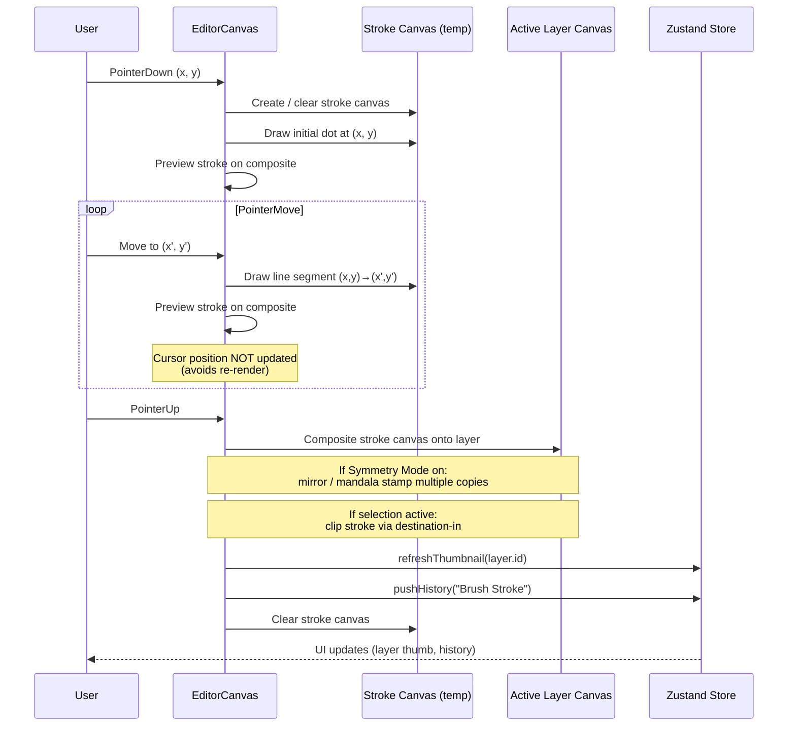
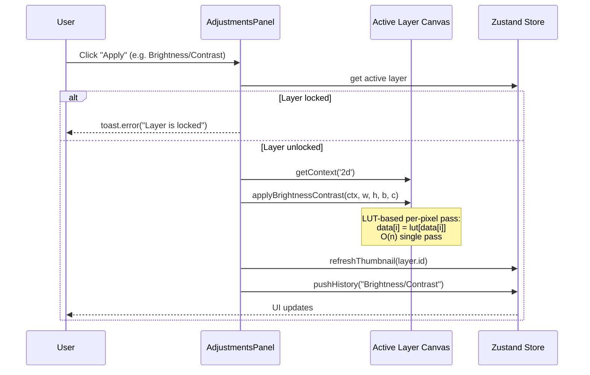
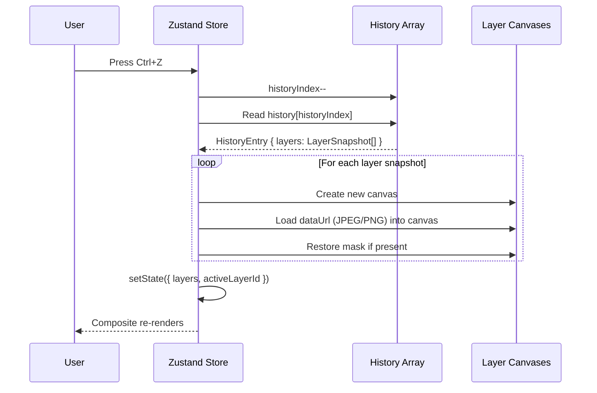

# Architecture

This document describes the system design, data flow, and technical implementation of Pixel Lab. It is intended for contributors who want to understand how the editor works under the hood before extending it.

## Table of Contents

- [Overview](#overview)
- [Core Design Principles](#core-design-principles)
- [State Management](#state-management)
  - [Zustand Store](#zustand-store-editor-storets)
  - [Layer Data Model](#layer-data-model)
  - [History System](#history-system)
- [Canvas Rendering Engine](#canvas-rendering-engine)
  - [Three-Canvas Architecture](#three-canvas-architecture)
  - [Composite Rendering](#composite-rendering)
  - [Stroke Canvas](#stroke-canvas-brushpencileraser)
- [Tool Implementation](#tool-implementation)
  - [Tool Categories](#tool-categories)
  - [Magic Wand / Bucket Fill (Scanline Flood Fill)](#magic-wand--bucket-fill-scanline-flood-fill)
  - [Symmetry Mode](#symmetry-mode)
- [Image Processing](#image-processing)
  - [Filter Architecture](#filter-architecture)
  - [LUT-Based Filters](#lut-based-filters-optimized)
  - [Lightroom-Style Develop Adjustments](#lightroom-style-develop-adjustments)
  - [Vectorization Pipeline](#vectorization-pipeline)
- [Performance System](#performance-system)
- [Responsive Design](#responsive-design)
- [Theme System](#theme-system)
- [File Organization](#file-organization)
- [Data Flow](#data-flow)
  - [Drawing a Brush Stroke](#drawing-a-brush-stroke)
  - [Applying a Filter](#applying-a-filter)
  - [Undo/Redo](#undoredo)
- [Extension Points](#extension-points)
  - [Adding a New Tool](#adding-a-new-tool)
  - [Adding a New Filter](#adding-a-new-filter)
  - [Adding a New Store Feature](#adding-a-new-store-feature)
- [Pointer Capture System](#pointer-capture-system)
- [Mobile Layout Architecture](#mobile-layout-architecture)
- [New Algorithms](#new-algorithms)
- [Tutorial System](#tutorial-system)
- [AI Editing Agent (Gemini-powered)](#ai-editing-agent-gemini-powered)
- [Build & Deployment](#build--deployment)

---

## Overview

Pixel Lab is a client-side image editor built on Next.js 16 with TypeScript. All image processing happens in the browser using the HTML5 Canvas API — there is no server-side image processing. The application uses a Zustand store for state management and a custom canvas rendering engine for the editor. An optional AI editing agent (Gemini-powered) lets users describe edits in natural language; the agent calls Google's Gemini API directly from the browser and translates responses into the editor's existing tools. See [AI Editing Agent](#ai-editing-agent-gemini-powered) below for details.

```
┌─────────────────────────────────────────────────────────────┐
│                    Browser (Client-side)                     │
│  ┌───────────────────────────────────────────────────────┐  │
│  │              React Component Tree                      │  │
│  │  ┌─────────────┐  ┌──────────────┐  ┌──────────────┐ │  │
│  │  │  Toolbar    │  │ EditorCanvas │  │   Panels     │ │  │
│  │  │  (tools)    │  │  (rendering) │  │ (Layers etc) │ │  │
│  │  └──────┬──────┘  └──────┬───────┘  └──────┬───────┘ │  │
│  │         │                │                  │         │  │
│  │         └────────────────┼──────────────────┘         │  │
│  │                          ▼                             │  │
│  │              ┌───────────────────────┐                 │  │
│  │              │   Zustand Store       │                 │  │
│  │              │   (editor-store.ts)   │                 │  │
│  │              └───────────┬───────────┘                 │  │
│  │                          │                             │  │
│  │  ┌───────────────────────▼──────────────────────────┐  │  │
│  │  │          Canvas Rendering Engine                  │  │  │
│  │  │  ┌─────────────┐  ┌─────────────┐  ┌──────────┐  │  │  │
│  │  │  │ Composite   │  │  Overlay    │  │  Layer   │  │  │  │
│  │  │  │ Canvas      │  │  Canvas     │  │  Canvases│  │  │  │
│  │  │  │ (visible)   │  │  (UI)       │  │  (data)  │  │  │  │
│  │  │  └─────────────┘  └─────────────┘  └──────────┘  │  │  │
│  │  └──────────────────────────────────────────────────┘  │  │
│  │                                                        │  │
│  │  ┌──────────────────────────────────────────────────┐  │  │
│  │  │  AI Agent (optional, user provides Gemini key)   │  │  │
│  │  │  AgentPanel → agent-runner → Gemini API (direct) │  │  │
│  │  │  Tool calls mutate an OFFSCREEN workspace only;  │  │  │
│  │  │  user Accept/Reject decides whether to commit    │  │  │
│  │  │  to the live editor-store + history.             │  │  │
│  │  └──────────────────────────────────────────────────┘  │  │
│  └───────────────────────────────────────────────────────┘  │
└─────────────────────────────────────────────────────────────┘
```

## Core Design Principles

1. **Client-side only** — All processing happens in the browser. No server roundtrips for editing operations. (The only external API call is the user's own Gemini key, sent directly to Google by the AI agent — never to a backend of ours.)
2. **Canvas-based** — Each layer is an offscreen `<canvas>` element. The visible canvas is a composite of all layers.
3. **Non-destructive** — Layer masks, history snapshots, and adjustment layers preserve original data.
4. **Performance-first** — LUTs, scanline algorithms, and throttling keep operations fast.
5. **Responsive** — Mobile and desktop share the same codebase with adaptive UI.
6. **AI agent safety** — Every agent tool call mutates a cloned offscreen workspace, never the live canvas. The undo stack is touched only on explicit Accept.

## State Management

### Zustand Store (`editor-store.ts`)

The entire editor state lives in a single Zustand store. This avoids prop drilling and allows any component to read or update state.

```typescript
interface EditorState {
  // Document
  docWidth: number;
  docHeight: number;
  docName: string;

  // Layers (each layer has its own canvas)
  layers: LayerData[];
  activeLayerId: string | null;

  // Tool state
  activeTool: ToolType;
  toolOptions: ToolOptions;

  // Colors
  foregroundColor: string;
  backgroundColor: string;

  // Selection (mask canvas)
  selectionMask: HTMLCanvasElement | null;
  selectionBounds: { x, y, w, h } | null;

  // History (undo/redo)
  history: HistoryEntry[];
  historyIndex: number;

  // View
  zoom: number;
  panX: number;
  panY: number;

  // Guides & rulers
  guides: { x: number[]; y: number[] };
  showRulers: boolean;
  showGrid: boolean;

  // Performance
  perfSettings: PerfSettings;

  // Actions (95+ methods)
  // ...
}
```

### Layer Data Model

Each layer is represented by:

```typescript
interface LayerData {
  id: string;
  name: string;
  visible: boolean;
  opacity: number;          // 0 to 1
  blendMode: BlendMode;     // 16 modes
  locked: boolean;
  canvas: HTMLCanvasElement; // Offscreen canvas with pixel data
  thumbnail: string;         // Data URL for panel preview
  maskCanvas: HTMLCanvasElement | null; // Non-destructive mask
  maskEnabled: boolean;
}
```

### History System

History entries store serialized snapshots of all layers:

```typescript
interface HistoryEntry {
  id: string;
  label: string;
  timestamp: number;
  layers: LayerSnapshot[];
  activeLayerId: string | null;
}

interface LayerSnapshot {
  id: string;
  name: string;
  visible: boolean;
  opacity: number;
  blendMode: BlendMode;
  locked: boolean;
  dataUrl: string;        // JPEG (opaque) or PNG (transparent)
  maskDataUrl: string | null;
  maskEnabled: boolean;
}
```

**Memory optimization**: History snapshots use JPEG for opaque layers (5-10x smaller than PNG) and PNG only when alpha transparency is present. The history cap is configurable based on device performance tier (15/30/60 states).

## Canvas Rendering Engine

### Three-Canvas Architecture

```
┌─────────────────────────────────────────┐
│         Container (div)                  │
│  ┌───────────────────────────────────┐  │
│  │  Composite Canvas (visible)       │  │  ← User sees this
│  │  - Renders all visible layers     │  │
│  │  - Updated on every change        │  │
│  ├───────────────────────────────────┤  │
│  │  Overlay Canvas (UI)              │  │  ← Selection, guides, grid
│  │  - Marching ants, lasso preview   │  │
│  │  - Pen tool path, guides          │  │
│  │  - pointer-events: none           │  │
│  └───────────────────────────────────┘  │
│  ┌───────────────────────────────────┐  │
│  │  Layer Canvases (offscreen)       │  │  ← One per layer
│  │  - layer[0].canvas                │  │
│  │  - layer[1].canvas                │  │
│  │  - ...                            │  │
│  └───────────────────────────────────┘  │
└─────────────────────────────────────────┘
```

### Composite Rendering

The `composite()` function renders all visible layers onto the composite canvas:

```typescript
function composite() {
  // Only resize if dimensions changed (avoids GPU reallocation)
  if (canvas.width !== docWidth) canvas.width = docWidth;
  if (canvas.height !== docHeight) canvas.height = docHeight;
  ctx.clearRect(0, 0, docWidth, docHeight);

  for (const layer of layers) {
    if (!layer.visible) continue;
    ctx.globalAlpha = layer.opacity;
    ctx.globalCompositeOperation = layer.blendMode;

    if (layer.maskCanvas && layer.maskEnabled) {
      // Apply mask via destination-in compositing
      const tmp = createBlankCanvas(docWidth, docHeight);
      tmpCtx.drawImage(layer.canvas, 0, 0);
      tmpCtx.globalCompositeOperation = 'destination-in';
      tmpCtx.drawImage(layer.maskCanvas, 0, 0);
      ctx.drawImage(tmp, 0, 0);
    } else {
      ctx.drawImage(layer.canvas, 0, 0);
    }
  }
}
```

### Stroke Canvas (Brush/Pencil/Eraser)

Brush strokes use a temporary "stroke canvas" that accumulates the current stroke. This allows:
- Live preview during drawing
- Committing the stroke to the layer only on pointer-up
- Selection-aware clipping

```
Pointer Down → Clear stroke canvas → Draw segment
Pointer Move → Draw segment on stroke canvas → Preview on composite
Pointer Up   → Composite stroke canvas onto layer → Clear stroke canvas
```

## Tool Implementation

### Tool Categories

| Category | Tools | Implementation |
|----------|-------|----------------|
| Selection | Marquee, Lasso, Magic Wand | Creates `selectionMask` canvas |
| Painting | Brush, Pencil, Eraser | Stroke canvas + commit on pointer-up |
| Sampling | Clone Stamp, Healing Brush | Alt+Click sets source, then paint |
| Vector | Pen, Shapes, Text | Bezier paths, shape drawing, text rendering |
| Liquify | Push, Pucker, Bloat, Twirl | Pixel displacement with bilinear sampling |
| View | Hand, Zoom | Pan and zoom controls |

### Magic Wand / Bucket Fill (Scanline Flood Fill)

Both use an optimized scanline flood fill algorithm:

```typescript
// O(n) scanline fill — much faster than BFS with queue.shift()
const stack = [startIdx];
while (stack.length > 0) {
  const idx = stack.pop();
  if (filled[idx] || !matches(idx)) continue;

  // Find horizontal span [lx, rx]
  let lx = x; while (lx > 0 && !filled[...] && matches(...)) lx--;
  let rx = x; while (rx < W-1 && !filled[...] && matches(...)) rx++;

  // Fill span and push neighbors above/below
  for (let fx = lx; fx <= rx; fx++) {
    filled[y * W + fx] = 1;
    if (y > 0 && matches(idx - W)) stack.push(idx - W);
    if (y < H-1 && matches(idx + W)) stack.push(idx + W);
  }
}
```

### Symmetry Mode

Symmetry is implemented by mirroring the stroke canvas when committing:

```typescript
function commitStrokeToLayer() {
  const symmetryPoints = applySymmetry({ x: 0, y: 0 });
  for (const offset of symmetryPoints) {
    ctx.save();
    if (offset.x !== 0) {
      ctx.translate(docWidth, 0);
      ctx.scale(-1, 1);  // Mirror horizontally
    }
    ctx.drawImage(strokeCanvas, 0, 0);
    ctx.restore();
  }
}
```

Modes: None, Horizontal, Vertical, Quad (4-way), Mandala (rotational, 2-12 segments).

## Image Processing

### Filter Architecture

Filters operate directly on a layer's canvas context:

```typescript
function applyFilter(ctx: CanvasRenderingContext2D, w: number, h: number, ...) {
  const imageData = ctx.getImageData(0, 0, w, h);
  const data = imageData.data;
  // Process data...
  ctx.putImageData(imageData, 0, 0);
}
```

### LUT-Based Filters (Optimized)

Many filters use 256-entry lookup tables (LUTs) for O(1) per-pixel operations:

```typescript
function applyBrightnessContrast(ctx, w, h, brightness, contrast) {
  const lut = new Uint8Array(256);
  for (let i = 0; i < 256; i++) {
    lut[i] = clamp(i * contrastFactor + intercept + brightness);
  }
  // Single pass through pixels — no math, just array lookup
  for (let i = 0; i < data.length; i += 4) {
    data[i] = lut[data[i]];
    data[i + 1] = lut[data[i + 1]];
    data[i + 2] = lut[data[i + 2]];
  }
}
```

**Optimized filters**: Brightness/Contrast, Invert, Grayscale, Sepia, Threshold, Levels, Curves.

### Lightroom-Style Develop Adjustments

The Develop panel (`DevelopPanel.tsx`) provides Lightroom-style photo development controls via functions in `image-processing.ts`:

| Section | Functions | Description |
|---------|-----------|-------------|
| Light | `applyHighlightsShadows`, `applyWhitesBlacks`, `applyClarity`, `applyDehaze`, `applyTexture` | Selective tone adjustments targeting bright/dark/mid-tone pixels |
| Color | `applyVibrance`, `applySaturation` | Vibrance boosts less-saturated colors more; Saturation is uniform |
| Effects | `applyGrain`, `applyLensVignette` | Film grain with size control; lens vignette with midpoint/roundness/feather |
| Detail | `applySharpening`, `applyLuminanceNR`, `applyColorNR` | Sharpening with radius/detail; luminance & color noise reduction |
| Split Toning | `applySplitToning` | Different color tints for highlights vs shadows with balance control |

Key algorithms:
- **Highlights/Shadows**: Uses luminance-based masks — highlights only affect pixels above 50% brightness, shadows only affect pixels below 50%
- **Clarity**: Large-radius local contrast enhancement (blurred image deviation boost)
- **Texture**: Small-radius local contrast (fine detail enhancement)
- **Dehaze**: Combined contrast + saturation boost with slight darkening
- **Vibrance**: Saturation boost weighted by inverse of current saturation (less-saturated colors get more boost)
- **Split Toning**: Hue/saturation tinting with luminance-based masks for highlights and shadows

### Vectorization Pipeline

The vectorization process (`vectorize.ts`):

```
1. Color Quantization (Median Cut)
   ├── Sample pixels (5-bit per channel for performance)
   ├── Build color buckets
   └── Median cut to N colors (2-32)

2. Label Map Creation
   └── Map each pixel to nearest palette color

3. Connected Component Analysis
   ├── Flood fill to find regions
   └── Filter by minimum area (detail setting)

4. Boundary Tracing (Moore Neighborhood)
   └── Trace edge of each region

5. Path Simplification (Ramer-Douglas-Peucker)
   ├── Adaptive tolerance based on path size
   └── Handle closed paths (start ≈ end)

6. SVG Generation
   ├── Quadratic Bezier curves (smoothing > 30)
   └── Output as SVG string
```

## Performance System

### Device Tier Detection

```typescript
function detectPerfTier(): PerfTier {
  const cores = navigator.hardwareConcurrency || 4;
  const mem = navigator.deviceMemory || 4;
  const isMobile = /Android|iPhone|iPad/i.test(navigator.userAgent);

  if (isMobile || cores <= 2 || mem <= 2) return 'low';
  if (cores >= 8 && mem >= 8) return 'high';
  return 'medium';
}
```

### Performance Settings

| Setting | Low | Medium | High |
|---------|-----|--------|------|
| Max History States | 15 | 30 | 60 |
| Thumbnail Size | 32px | 48px | 64px |
| History JPEG Quality | 60% | 70% | 85% |
| Real-time Preview | Off | On | On |
| Offscreen Canvas | Off | On | On |
| Slider Debounce | 150ms | 50ms | 0ms |

### Optimizations Applied

1. **Scanline flood fill** — O(n) vs O(n²) for Magic Wand, Bucket Fill, Auto BG Remove
2. **LUT-based filters** — 256-entry tables for O(1) per-pixel operations
3. **Shadow-blur soft brush** — Single GPU-accelerated pass vs 8 alpha layers
4. **JPEG history snapshots** — 5-10x memory reduction for opaque layers
5. **Throttled marching ants** — 15fps instead of 60fps
6. **Cursor position optimization** — Only updates state when not drawing
7. **Composite canvas reuse** — Only resizes when dimensions change

## Responsive Design

### Breakpoint Strategy

- **Mobile** (< 768px): Hamburger menu, floating panel button, compact options bar
- **Desktop** (≥ 768px): Inline menu bar, side panels, full options bar

### Mobile Layout

```
┌─────────────────────────┐
│ ☰  ⚡ Pixel Lab  🎨 ⚙ │  ← Title bar with hamburger
├─────────────────────────┤
│ [Tool] [Options...]     │  ← Compact options bar
├─────────────────────────┤
│                         │
│      Canvas Area        │
│                         │
│                 ┌────┐  │
│                 │ 📊 │  │  ← Floating panel button
│                 └────┘  │
└─────────────────────────┘
```

## Theme System

### CSS Variables

Editor-specific CSS variables adapt to light/dark mode:

```css
:root {
  --editor-bg: oklch(0.98 0 0);
  --editor-surface: oklch(1 0 0);
  --editor-text: oklch(0.2 0 0);
  --editor-accent: oklch(0.55 0.18 240);
}

.dark {
  --editor-bg: oklch(0.145 0 0);
  --editor-surface: oklch(0.185 0 0);
  --editor-text: oklch(0.95 0 0);
  --editor-accent: oklch(0.65 0.18 240);
}
```

### Theme Detection

Uses `next-themes` with `defaultTheme="system"` to auto-detect OS preference. Users can override with the theme toggle (Light/Dark/System).

## File Organization

### Core Libraries (`src/lib/`)

| File | Responsibility |
|------|---------------|
| `editor-types.ts` | TypeScript type definitions (40 tool types, 16+ tool options) |
| `editor-store.ts` | Zustand store with all state and actions (clipboard, adjustment layers, recent files, export presets, custom shortcuts, tutorial, guides) |
| `image-processing.ts` | Filter algorithms, Lightroom develop adjustments, LUT color grading, content-aware fill, seamless pattern maker, offset filter, align layers (~1950 lines) |
| `vectorize.ts` | Raster-to-SVG vectorization pipeline |
| `vector-shapes.ts` | Illustrator-style vector shapes (star, polygon, arrow, heart, speech bubble, spiral, calligraphy stroke, scatter brush, path smoothing) |
| `perf.ts` | Performance utilities, device detection, RAF throttle, canvas pool, memory manager |
| `agent/agent-store.ts` | Zustand slice for the AI agent — in-memory API key (never persisted), model preference (persisted), chat thread, pending preview, cancel token |
| `agent/gemini-client.ts` | Thin wrapper around Gemini `generateContent` REST endpoint with `functionDeclarations`; sends canvas as 1024px JPEG inline part |
| `agent/tools.ts` | 14-tool schema + executor wrapping existing editor functions (filters, develop, selection, drawing, text, bucket fill) |
| `agent/agent-runner.ts` | Orchestration loop — offscreen workspace snapshot, tool-call loop with progress events, MAX_TOOL_CALLS=8 hard stop, commit/reject |

### Components (`src/components/editor/`)

| Component | Responsibility |
|-----------|---------------|
| `PhotoEditor.tsx` | Main container, responsive layout, drag-and-drop import, mobile bottom toolbar |
| `EditorCanvas.tsx` | Canvas rendering, 40 tool implementations, pointer capture, auto-fit zoom (~1800 lines) |
| `Toolbar.tsx` | Left tool buttons (desktop), 40 tools across 6 sections |
| `OptionsBar.tsx` | Context-sensitive tool options with mobile-compact layout |
| `MenuBar.tsx` | Top menu (File, Edit, Image, Layer, Filter, Vector, View) with 100+ menu items |
| `LayersPanel.tsx` | Layer list, masks, blend modes, align, copy/paste |
| `AdjustmentsPanel.tsx` | Filters and adjustments UI with Pro Color Tools |
| `DevelopPanel.tsx` | Lightroom-style develop panel (Light, Color, Effects, Detail, Split Toning) |
| `ColorPanel.tsx` | Color picker, swatches |
| `HistoryPanel.tsx` | Undo/redo history |
| `NavigatorPanel.tsx` | Minimap, brush presets |
| `AgentPanel.tsx` | AI editing agent UI — Copilot-Chat-style chat thread, model picker, API key input, before/after preview with Accept/Reject, Stop button |
| `VectorizeDialog.tsx` | Vectorization dialog with live preview |
| `NewDocumentDialog.tsx` | 24 document templates |
| `Onboarding.tsx` | 7-step onboarding tour for new users |
| `TutorialPanel.tsx` | 12-step interactive tutorial with auto-detection |
| `ThemeToggle.tsx` | Light/dark/system toggle |
| `PerformanceControls.tsx` | FPS counter, performance settings popover |

## Data Flow

### Drawing a Brush Stroke



**Step-by-step:**

1. User clicks canvas (PointerDown)
   → `onPointerDown()` creates stroke canvas, draws initial dot
2. User drags (PointerMove)
   → `onPointerMove()` draws line segment on stroke canvas
   → `previewStroke()` composites stroke onto visible canvas
   → (cursor position NOT updated to avoid re-renders)
3. User releases (PointerUp)
   → `commitStrokeToLayer()` composites stroke canvas onto layer
   → Applies symmetry (mirror/mandala) if enabled
   → Applies selection mask if active
   → `refreshThumbnail()` updates layer panel preview
   → `pushHistory()` saves snapshot
   → `clearStrokeCanvas()` resets for next stroke

### Applying a Filter



**Step-by-step:**

1. User clicks "Apply" in Adjustments panel
   → `applyAdjustment()` gets active layer
   → Checks layer is not locked
   → Calls filter function (e.g., `applyBrightnessContrast`)
   → Filter uses LUT for fast per-pixel operation
   → `refreshThumbnail()` updates preview
   → `pushHistory()` records "Brightness/Contrast"

### Undo/Redo



**Step-by-step:**

1. User presses `Ctrl+Z`
   → `undo()` decrements `historyIndex`
   → `restoreFromHistory()` loads snapshots
   → For each layer snapshot:
     - Create new canvas
     - Load `dataUrl` (JPEG/PNG) into canvas
     - Restore mask if present
   → Update store with new `layers` array

**Redo** (`Ctrl+Y` / `Ctrl+Shift+Z`) is the mirror: increment `historyIndex`, restore that entry. The history array is truncated on any new edit (so redoing after a new action is impossible — standard behavior).


## Extension Points

### Adding a New Tool

1. Add tool type to `editor-types.ts`:
   ```typescript
   export type ToolType = '...' | 'new-tool';
   ```

2. Add tool options if needed in `ToolOptions` interface

3. Add default value in `DEFAULT_TOOL_OPTIONS` in `editor-store.ts`

4. Add tool preset in `tool-presets.tsx`:
   ```typescript
   'new-tool': { icon: <Icon />, label: 'New Tool', hint: '...' },
   ```

5. Add to `TOOLS` array in `Toolbar.tsx` (choose the right section)

6. Implement tool logic in `EditorCanvas.tsx`:
   - Handle `onPointerDown` for tool
   - Handle `onPointerMove` for tool
   - Handle `onPointerUp` for tool
   - Add to `cursorStyle()` function
   - Add keyboard shortcut to the keyboard handler

7. Add options in `OptionsBar.tsx` if needed

### Adding a New Filter

1. Implement filter function in `image-processing.ts`:
   ```typescript
   export function applyNewFilter(ctx, w, h, param) {
     const lut = new Uint8Array(256);
     // Build LUT...
     applyLUTAll(ctx, w, h, lut);
   }
   ```

2. Add UI control in `AdjustmentsPanel.tsx` or menu item in `MenuBar.tsx`

3. Use `applyAdjustment()` helper to apply with history recording

## Build & Deployment

### Adding a New Store Feature

1. Add state and action types to the `EditorState` interface in `editor-store.ts`
2. Add initial state value
3. Implement the action function
4. Subscribe to the state in components using `useEditorStore((s) => s.feature)`
5. For persisted state, use `localStorage` (see `exportPresets` or `customShortcuts` for examples)

## Pointer Capture System

The editor uses `setPointerCapture()` on every pointer-down event to ensure smooth drawing:

```typescript
const onPointerDown = useCallback((e: React.PointerEvent) => {
  // Always capture pointer so we keep getting move/up events even outside canvas
  (e.currentTarget as HTMLElement).setPointerCapture(e.pointerId);
  // ... tool-specific logic
}, [...]);
```

- `onPointerLeave` is NOT used to end strokes (removed to fix mobile drawing bug)
- `onPointerCancel` handles touch cancellation (system notifications, etc.)
- `touch-action: none` on canvas and container prevents browser gesture interference
- This ensures strokes continue even when the pointer leaves the canvas bounds

## Mobile Layout Architecture

### Responsive Detection
```typescript
const check = () => {
  const mobile = window.innerWidth < 768;
  setIsMobile(mobile);
  if (mobile) { setPanelOpen(false); }
  else { setPanelOpen(true); }
};
```

### Mobile Bottom Toolbar
On mobile, the left sidebar toolbar is replaced with a horizontal scrollable bottom bar:
- Color swatches row (foreground, swap, background)
- 10 quick-access tools (Move, Brush, Eraser, Fill, Rect, Ellipse, Text, Pick, Crop, Wand)
- Expandable to 20+ tools via "⋯" button
- Each tool shows icon + text label

### Auto-Fit Zoom
The auto-fit system re-fits when container dimensions change:
```typescript
// Re-fit when container size changes (viewport resize, mobile/desktop switch)
if (containerSize.w === lastFitW.current && containerSize.h === lastFitH.current) return;
// Mobile: 20px margin, allow 2x zoom to fill screen
// Desktop: 60px margin, cap at 1x
```

## New Algorithms

### Content-Aware Fill (No AI)
Samples surrounding non-masked pixels and averages them with noise:
```typescript
for each masked pixel:
  sample radius=20 neighborhood
  skip other masked pixels
  average RGB values
  add random noise (±5)
  fill pixel with averaged+noised value
```

### LUT Color Grading (.cube file)
Parses standard .cube LUT files and applies them with intensity control:
- `parseCubeLUT()` reads the text format, extracts 3D LUT entries
- Simplifies to 256-entry per-channel LUTs (R, G, B)
- `applyCubeLUT()` blends original and LUT-graded pixels by intensity factor

### Seamless Pattern Maker
Offsets image by half in both dimensions and reassembles 4 quadrants:
```
Original:     Result:
[A][B]   →   [D][C]
[C][D]       [B][A]
```

### Align Layers
Finds each layer's content bounds (non-transparent pixels) and computes alignment offsets:
- Scans each layer's alpha channel for min/max X/Y
- Computes offset based on alignment type (left, center, right, top, middle, bottom)
- Creates new canvas with offset content drawn at new position

### Drag-and-Drop Import
The main container has `onDragOver` and `onDrop` handlers:
```typescript
onDrop={(e) => {
  const file = e.dataTransfer.files?.[0];
  // Create new document sized to image
  // Add layer with image content
  // Add to recent files
}}
```

## Tutorial System

### Onboarding Tour (7 steps)
- Shows on first visit (localStorage check)
- Can be replayed via View → Show Onboarding Tour
- Pure presentation (no action detection)

### Interactive Tutorial (12 steps)
- Loads a procedurally-generated landscape image
- Monitors Zustand store for step completion
- Auto-advances when user performs the required action (tool selection, filter application, etc.)
- Manual "Skip Step" button for stuck users
- Step detection checks history labels and active tool state

## AI Editing Agent (Gemini-powered)

The AI Editing Agent is a Copilot-Chat-style panel that translates natural-language prompts into real editor operations. It is mounted as a new "Agent" tab in `PhotoEditor.tsx`, following the same Tabs pattern as the other right-side panels.

### Module Layout (`src/lib/agent/`)

```
src/lib/agent/
├── agent-store.ts   # Zustand slice — in-memory API key, chat thread, pending preview, self-eval result, preference memory (localStorage)
├── gemini-client.ts # Thin wrapper around Gemini generateContent + evaluateEditQuality (vision-based self-eval)
├── tools.ts         # 16-tool schema + executor (wraps existing editor functions)
└── agent-runner.ts  # Orchestration loop — offscreen workspace, MAX_TOOL_CALLS, self-eval + retry, preference memory, commit/reject
```

UI lives in `src/components/editor/AgentPanel.tsx`.

### Security Model (Critical)

The Gemini API key lives **only in browser JS memory** (Zustand store slice). It is:

| Property | Value |
|---|---|
| Storage | Zustand slice, in-memory only |
| `localStorage` | **Never** (the key itself) |
| `sessionStorage` | **Never** |
| Cookies | **Never** |
| Sent to our backend | **Never** |
| Sent to Google | Yes — as `?key=` query param on `generateContent` |

The model preference (Flash-Lite / Flash / Pro) **is** persisted to `localStorage` — it is a non-secret UI preference, identical in sensitivity to a theme choice.

**Preference memory** (the user's accept/reject history) **is** also persisted to `localStorage` under `pixel-lab-agent-preferences`. It contains only:
- The user's natural-language request text (e.g. "brighten the sky")
- The agent's action label + tool-call labels (e.g. "Applied Gaussian Blur")
- The decision (`accepted` / `rejected`)
- The agent's self-eval score + reasoning (1–10 + 1–2 sentences)

It does **NOT** contain: the API key, image data, canvas pixels, or any personally-identifying information. It is capped at 50 entries (~100KB max) and can be cleared at any time via the "Clear memory" button in the preference panel. See [SECURITY_NOTES.md](SECURITY_NOTES.md) for the full honest disclosure, including the limitations of any client-side API key flow (XSS, malicious extensions, device access).

### Tool-Calling Loop (with self-evaluation + retry)

```mermaid
flowchart TD
    U[User types: draw a red circle in the center] --> SNAP

    SNAP["agent-runner.ts:<br/>snapshotWorkspace()<br/><b>Deep-clone all layers + selection mask<br/>into an OFFSCREEN workspace</b><br/>(live editor-store is NEVER touched during the loop)"]
    SNAP --> BEFORE[Save beforeDataUrl for diff]
    BEFORE --> PREF[🆕 Read preference memory from localStorage<br/>and append summary to system prompt<br/>(empty on first run; grows over time)]
    PREF --> IMG[Downscale composite to 1024px JPEG<br/>as Gemini inline image part]
    IMG --> GEN

    GEN["gemini-client.ts:<br/>generateContent()<br/>POST to generativelanguage.googleapis.com<br/>with functionDeclarations + image"]
    GEN --> CHECK{Model returns?}

    CHECK -- text-only --> SELFEVAL
    CHECK -- functionCall(s) --> LOOP

    LOOP["For each functionCall:<br/>1. Execute against WORKSPACE (not live store)<br/>2. Emit progress chip to chat UI<br/>3. Append functionResponse to contents"]
    LOOP --> CANCEL{Cancelled?<br/>Check cancelToken}
    CANCEL -- Yes --> END_CANCEL[Status: cancelled<br/>Canvas untouched]
    CANCEL -- No --> MAX{toolCallCount<br/>>&nbsp;MAX_TOOL_CALLS?<br/>(= 8)}
    MAX -- Yes --> ERR[Surface error:<br/>Hit MAX_TOOL_CALLS]
    MAX -- No --> GEN

    SELFEVAL["🆕 Self-evaluation step<br/>(status: self-evaluating)<br/>evaluateEditQuality():<br/>send BEFORE + AFTER images to Gemini Vision<br/>ask for 1-10 score + reasoning<br/>(uses a stronger vision model than the<br/>tool-calling model — Flash-Lite → Flash)"]
    SELFEVAL --> SCORE{Score ≥ 7?}

    SCORE -- Yes --> PREV
    SCORE -- No --> RETRY{Retries left?<br/>(max 2)}
    RETRY -- Yes --> RESET[Reset workspace to original snapshot<br/>Prepend feedback to prompt:<br/>'Previous attempt scored N/10: ...'<br/>Loop back to GEN]
    RESET --> GEN
    RETRY -- No --> PREV_BEST[Use the best-scoring attempt<br/>from all retries so far]
    PREV_BEST --> PREV

    PREV["Build before/after preview<br/>compositeWorkspace(ws) → afterDataUrl<br/>🆕 Stash self-eval score + reasoning<br/>Set status: awaiting-accept"]
    PREV --> UI

    UI["AgentPanel UI shows<br/>before/after preview<br/>🆕 + self-eval score + reasoning<br/>+ Accept / Reject buttons"]
    UI -- User clicks Accept --> COMMIT
    UI -- User clicks Reject --> REJECT
    UI -- User clicks Stop --> END_CANCEL

    COMMIT["commitPreview()<br/>Copy workspace layers back to live store<br/>(preserves per-layer structure + alpha)<br/>pushHistory() — same structure as manual edit<br/>🆕 Record 'accepted' to preference memory<br/>(includes user request, action, self-score)<br/>Ctrl+Z undoes it normally"]
    COMMIT --> DONE[Status: done]

    REJECT["rejectPreview()<br/>Discard preview<br/>Undo stack UNTOUCHED<br/>🆕 Record 'rejected' to preference memory<br/>(includes user request, action, self-score)"]
    REJECT --> IDLE[Status: idle]

    style SNAP fill:#fef3c7,stroke:#d97706
    style GEN fill:#dbeafe,stroke:#2563eb
    style SELFEVAL fill:#e9d5ff,stroke:#9333ea
    style RESET fill:#fef3c7,stroke:#d97706
    style COMMIT fill:#d1fae5,stroke:#059669
    style REJECT fill:#fee2e2,stroke:#dc2626
    style ERR fill:#fecaca,stroke:#dc2626
    style END_CANCEL fill:#e5e7eb,stroke:#6b7280
    style PREF fill:#fce7f3,stroke:#db2777
```

**Key safety properties:**

- The live `editor-store` is never touched during the loop — only the offscreen workspace is mutated.
- `cancelToken` is checked between every Gemini call and every tool execution. The Stop button bumps the token.
- `MAX_TOOL_CALLS = 8` prevents infinite loops if the model keeps returning function calls forever.
- An `AbortController` is also passed to `fetch()` so the in-flight HTTP request is cancelled on Stop.
- On Reject, no history entry is pushed — the undo stack is identical to before the run started.
- 🆕 Self-eval never blocks the preview — if the vision call fails, the runner falls back to a permissive score (8) so the user still sees the edit.
- 🆕 Retries reset the workspace to the original snapshot (so retry attempts don't compound on top of a bad edit).
- 🆕 If all retries fail to clear the threshold, the **best-scoring** attempt is shown (not the last) — the user can then reject and try a different prompt.
- 🆕 Preference memory is appended to the system prompt **before** the tool-calling loop, so the agent can adapt its tool selection and parameters to what the user has accepted in the past.

### 🆕 Self-Evaluation (vision-based quality review)

The agent's tool-calling model only gets text back from the tools — it can't natively "see" whether its edit accomplished what the user asked. The self-evaluation step bridges this gap.

**`evaluateEditQuality()` in `gemini-client.ts`** sends the BEFORE + AFTER images to Gemini Vision with a strict QA prompt:

```
You are a strict photo-editing QA reviewer. The user asked: "USER_REQUEST".
The agent claims: "AGENT_SUMMARY".
Evaluate the AFTER image vs the BEFORE image.
Reply ONLY with JSON: {"score": <1-10>, "reasoning": "<short>"}
```

The model is asked to consider:
1. Did the edit accomplish what the user asked for?
2. Is the edit visible (not a no-op)?
3. Did the edit go too far (clipped highlights, oversaturated)?
4. Did the edit affect the wrong region?
5. Are there obvious artifacts (halos, banding, blotchy noise)?

**Model selection:** The user's selected model might be Flash-Lite (chosen for cost during the tool-calling loop), but for self-eval we want the best vision quality we can get. `pickVisionModel()` upgrades Flash-Lite → Flash, and keeps Pro as Pro. If the vision model isn't available (e.g. the user's API key doesn't have access), we fall back to the user's selected model. If that also fails, we return a permissive default (score 8) so the preview is never blocked.

**JSON mode:** We use `responseMimeType: 'application/json'` for reliable parsing. The `parseSelfEvalResponse()` helper is defensive — it handles malformed JSON, extra prose around the JSON, and missing fields, always returning a valid `SelfEvalResult`.

**Constants:**
- `SELF_EVAL_THRESHOLD = 7` — minimum score to show the preview without retrying. 7 = "Acceptable — accomplishes the request but with noticeable issues."
- `MAX_SELF_EVAL_RETRIES = 2` — up to 2 retries (3 total attempts). Each retry costs one extra tool-calling loop + one extra vision call, so worst-case triples the per-request cost. That's acceptable because retries only happen when the edit is bad — most requests pass on the first attempt.

**Best-attempt tracking:** Across retries, the runner tracks the highest-scoring attempt (its text, after-image, workspace, score, reasoning, attempt number). If all retries fail to clear the threshold, the best attempt is shown to the user — never the last attempt, which might be worse than the first.

### 🆕 Preference Memory (learning from accept/reject)

Every Accept and Reject is recorded as a `PreferenceEntry` in `agent-store.ts`:

```typescript
interface PreferenceEntry {
  id: string;
  ts: number;
  userRequest: string;       // "brighten the sky a lot"
  agentAction: string;       // "AI: brighten the sky a lot (3 steps)"
  toolCalls: string[];       // ["Selected region by box", "Adjusted exposure", ...]
  decision: 'accepted' | 'rejected';
  selfScore?: number;        // 1-10, from the self-eval step
  selfReasoning?: string;
}
```

These are persisted to `localStorage` (`pixel-lab-agent-preferences` key, max 50 entries). On every new `runAgent()` call, `buildPreferenceSummary()` derives a short textual profile from the entry history and appends it to the system prompt:

```
USER PREFERENCE MEMORY (learned from past accept/reject decisions):
User acceptance rate so far: 67% (2 accepted, 1 rejected out of 3 edits).
User tends to ACCEPT edits involving: applied grayscale filter (2/2 accepted).
User tends to REJECT edits involving: brighten the sky a lot (1/1 rejected).
Self-evaluation agrees with user 100% of the time (3/3).
Recent ACCEPTED requests:
  ✓ "add a subtle vignette" → AI: add a subtle vignette
  ✓ "make it grayscale" → AI: make it grayscale
Recent REJECTED requests (avoid similar):
  ✗ "brighten the sky a lot" → AI: brighten the sky a lot (3 steps)

Adapt your edits to match what the user tends to accept. Avoid edits similar
to past rejected requests. When in doubt, prefer the style of edits the user
has accepted before.
```

The summary is intentionally short (3–8 lines) so it doesn't bloat the system prompt — the goal is to nudge the agent, not give it a textbook.

**Self-eval agreement rate:** The summary also reports how often the agent's self-eval score agreed with the user's decision (self-score ≥7 → predicted accept; <7 → predicted reject). This is a **calibration signal**: if the agreement rate drops, the self-eval prompt needs tuning. The user can see this stat in the preference memory panel (brain icon in the Luna header).


### Tool Set (16 tools)

Every tool wraps an existing function from `image-processing.ts`, `vector-shapes.ts`, or the editor-store's Magic Wand / Bucket Fill algorithms — **no filter logic is reimplemented**.

| Tool | Wraps | Notes |
|---|---|---|
| `applyFilter` | `applyFastBlur`, `applySharpen`, `applySepia`, `applyGrayscale`, `applyInvert`, `applyPosterize`, `applyPixelate`, `applyEdgeDetect`, `applyEmboss`, `addNoise`, `applyVignette` | Respects active selection |
| `adjustDevelop` | `applyBrightnessContrast`, `applyHighlightsShadows`, `applyWhitesBlacks`, `applyClarity`, `applyDehaze`, `applyTexture`, `applyVibrance`, `applySaturation`, `applySplitToning`, `applyGrain`, `applyLensVignette`, `applySharpening`, `applyLuminanceNR`, `applyColorNR` | One param per call |
| `selectRegionByPoint` | Magic Wand (ported from `EditorCanvas.tsx`) | Normalized 0-1 coords + tolerance |
| `selectRegionByBox` | Rectangular marquee | Normalized 0-1 bounding box |
| `invertSelection`, `deselectAll` | `editor-store` actions | |
| `contentAwareFill` | `contentAwareFill` from `image-processing.ts` | Requires active selection |
| `autoBackgroundRemove` | `autoRemoveBackground` | Edge flood-fill |
| `addAdjustmentLayer` | Bakes brightness/contrast, vibrance, exposure, hue/saturation into active layer | v1 bakes; non-destructive pipeline is an extension point |
| `drawShape` | `drawStar`, `drawPolygon`, `drawArrow`, `drawHeart` from `vector-shapes.ts`; canvas 2D API for ellipse/rect/line | Accepts any CSS color (hex, named, rgb(), hsl()) |
| `drawBrushStroke` | Canvas 2D API with shadow-blur soft brush | Freehand path through normalized points |
| `addText` | Canvas 2D API | Multi-line via `\n` |
| `fillBucket` | Scanline flood-fill (ported from `EditorCanvas.tsx`) | Accepts any CSS color |
| `undo` | No-op in preview (Reject is the real undo) | |

### Color Parsing

The `parseColor()` helper in `tools.ts` handles any CSS color string by leveraging the browser's CSS color parser:

```typescript
function parseColor(color: string): { r: number; g: number; b: number } {
  // Try hex first (fast path)
  if (color.startsWith('#')) return hexToRgb(color);
  // Fall back to browser parser via a hidden canvas
  const ctx = parseColorCtx ??= document.createElement('canvas').getContext('2d')!;
  ctx.fillStyle = '#000000';
  ctx.fillStyle = color;  // Browser resolves "red", "rgb(...)", "hsl(...)"
  const resolved = ctx.fillStyle;  // Always #rrggbb or #rrggbbaa
  // ...parse hex...
}
```

This lets the model pass natural colors like `"red"`, `"blue"`, `"yellow"` without needing hex codes.

### Offscreen Preview & Accept/Reject

This is the core safety mechanism. The flow:

1. **`snapshotWorkspace()`** — deep-clones all layers (each gets a new canvas with `drawImage` copy) and the selection mask.
2. Each tool call mutates the **workspace** in place — the live `editor-store` is never touched.
3. After the loop, `compositeWorkspace(ws)` produces the "after" image, and the originally-saved `beforeDataUrl` provides the "before".
4. UI shows a before/after preview with **Accept** / **Reject** buttons.
5. **Accept** (`commitPreview()`): loads the `afterDataUrl` into the active layer's canvas, calls `refreshThumbnail()`, and `pushHistory(preview.historyLabel)`. The history entry has the same structure as a manual edit — `Ctrl+Z` undoes it normally.
6. **Reject** (`rejectPreview()`): discards the preview. The undo stack is untouched because the workspace was offscreen all along.

### Cancellation & Hard Stop

- **Cancellation**: `agent-store` exposes a monotonic `cancelToken`. The runner captures it at start and checks between every Gemini call and every tool execution. The Stop button bumps the token, which causes the next check to return early. An `AbortController` is also passed to `fetch()` so the in-flight HTTP request is cancelled.
- **Hard stop**: if `toolCallCount > MAX_TOOL_CALLS` (8), the runner surfaces an error to the user instead of looping silently. This handles the case where the model keeps returning function calls forever.

### Gemini Request Body

The `generateContent` endpoint requires a specific body structure — unknown top-level fields cause HTTP 400:

```json
{
  "contents": [...],
  "tools": [{ "functionDeclarations": [...] }],
  "toolConfig": { "functionCallingConfig": { "mode": "AUTO" } },
  "systemInstruction": { "parts": [{ "text": "..." }] },
  "generationConfig": { "temperature": 0.2, "maxOutputTokens": 2048 }
}
```

Note: `temperature` and `maxOutputTokens` must be nested under `generationConfig`, not at the top level. This was a bug during initial development.

### System Prompt

The system prompt in `agent-runner.ts` teaches the model:
- The 16 available tools and their parameter ranges
- Normalized 0-1 coordinate convention (origin top-left)
- That any CSS color string is accepted
- 5 worked examples (grayscale, sky+vignette, red circle, blue background, "Hello" text)
- To reply with a short 1-2 sentence summary after tool calls
- 🆕 **Quality awareness** — that its edit will be self-reviewed by a vision model, with guidance on how to avoid retries (visible edit, right region, don't overshoot)
- 🆕 **Preference memory** — when entries exist, a "USER PREFERENCE MEMORY" section is appended with the user's accept rate, most-accepted/most-rejected tool types, recent examples, and self-eval agreement rate

### Adding a New Agent Tool

1. Add the tool declaration to `TOOL_DECLARATIONS` in `src/lib/agent/tools.ts` (Gemini schema with `name`, `description`, `parameters`).
2. Add a `case 'yourToolName':` block to the `executeTool` switch in the same file. Wrap an existing function from `image-processing.ts` or `editor-store.ts` — **do not reimplement filter logic**.
3. Validate and clamp all params before executing (never trust the model blindly).
4. Return `{ success, message, thumbnailBase64? }`.
5. If the tool mutates pixels, respect the active selection: draw to a temp canvas, then composite through `ws.selectionMask` via `destination-in`.
6. Add a `case` to `describeToolCall()` so the chat chip has a human-readable label.
7. Update the system prompt in `agent-runner.ts` to mention the new tool with a worked example.

> **Note on self-eval:** You do **not** need to update the self-eval prompt when adding a new tool. The self-eval prompt is generic — it asks the vision model to evaluate whether the edit accomplished the user's request, regardless of which tools were used. The preference memory's "most-accepted/most-rejected tool types" stat will automatically pick up the new tool's labels (since it groups by the first 3 words of each tool-call label).

### Extension Points (Out of Scope for v1)

- **Server-side proxy** for the API key — would remove client-side exposure entirely. Out of scope per the project's "no cloud dependency" design principle.
- **Segmentation model (SAM)** for tighter selection masks — the existing Magic Wand tolerance/flood-fill is used as a bridge. A future `selectRegionBySegmentation` tool could plug in here.
- **Per-step accept/reject** — currently the agent produces a single combined preview per turn (with self-eval retries happening transparently). A future config option could allow per-step review.
- **Tunable self-eval threshold** — currently fixed at 7/10. A setting could let advanced users make Luna stricter or more permissive.
- **Persistent chat history** — chat is per-session only. Could be persisted to `localStorage` if desired.
- **Per-tool preference breakdown UI** — the preference memory already tracks which tools correlate with accept/reject; surfacing this in a dedicated panel would help users understand their own patterns.

## Build & Deployment

### Development
```bash
bun run dev    # Start dev server on port 3000
bun run lint   # Run ESLint
```

### Production
```bash
bun run build  # Build for production
bun run start  # Start production server
```

The app is a standard Next.js application and can be deployed to Vercel, Netlify, or any Node.js host. All image processing is 100% client-side — no server-side processing required.
