# Contributing to Pixel Lab

Thank you for your interest in contributing to Pixel Lab! 🎉 This document provides guidelines, conventions, and information for contributors.

Whether you're fixing a typo, adding a new tool, or building a major feature — every contribution is welcome. Please read this document carefully before opening your first pull request.

## Table of Contents

- [Code of Conduct](#code-of-conduct)
- [Getting Started](#getting-started)
- [Development Workflow](#development-workflow)
- [Project Structure](#project-structure)
- [Key Files to Understand](#key-files-to-understand)
- [Coding Standards](#coding-standards)
  - [TypeScript](#typescript)
  - [React](#react)
  - [Canvas & Performance](#canvas--performance)
  - [Styling](#styling)
  - [ESLint](#eslint)
  - [Commit Messages](#commit-messages)
- [Adding New Features](#adding-new-features)
  - [Adding a New Tool](#adding-a-new-tool)
  - [Adding a New Filter](#adding-a-new-filter)
  - [Adding a Blend Mode](#adding-a-blend-mode)
  - [Adding a New Agent Tool](#adding-a-new-agent-tool)
  - [Security Considerations for Agent Changes](#security-considerations-for-agent-changes)
- [Testing](#testing)
  - [Manual Testing](#manual-testing)
  - [AI Agent Testing](#ai-agent-testing)
  - [Test Checklist for PRs](#test-checklist-for-prs)
- [Submitting Changes](#submitting-changes)
  - [Branching Strategy](#branching-strategy)
  - [Pull Request Process](#pull-request-process)
  - [PR Review Criteria](#pr-review-criteria)
- [Reporting Bugs](#reporting-bugs)
- [Feature Requests](#feature-requests)
- [Performance Guidelines](#performance-guidelines)
- [Questions?](#questions)

---

## Code of Conduct

Participation in this project is governed by our [Code of Conduct](.github/CODE_OF_CONDUCT.md). Please read it and be respectful, constructive, and welcoming in all interactions. Harassment or exclusionary behavior will not be tolerated.

By participating, you agree to uphold these standards.

---

## Getting Started

### Prerequisites

- **Node.js 18+** or **Bun** (recommended — faster installs and dev server)
- **Git** 2.20+
- A modern browser (Chrome, Firefox, Safari, Edge — latest 2 versions)
- Basic knowledge of TypeScript, React, and the Canvas API

### Development Setup

1. **Fork the repository** on GitHub.

2. **Clone your fork**:
   ```bash
   git clone https://github.com/YOUR-USERNAME/Pixel-Lab.git
   cd Pixel-Lab
   ```

3. **Add the upstream remote** (to keep your fork in sync):
   ```bash
   git remote add upstream https://github.com/touhidsiddiqueeraj-bit/Pixel-Lab.git
   ```

4. **Install dependencies**:
   ```bash
   bun install
   # or
   npm install
   ```

5. **Start the development server**:
   ```bash
   bun run dev
   ```
   The first compile takes ~5 seconds (Turbopack); subsequent hot-reloads are <200ms.

6. **Open the app** at [http://localhost:3000](http://localhost:3000).

7. **Verify linting passes** before you start making changes:
   ```bash
   bun run lint
   ```
   This should produce 0 errors and 0 warnings.

---

## Project Structure

```
src/
├── app/                        # Next.js App Router
│   ├── layout.tsx              # Root layout (ThemeProvider, metadata)
│   ├── page.tsx                # Main page (renders PhotoEditor)
│   └── globals.css             # Global styles + theme variables
├── lib/                        # Core libraries (framework-agnostic)
│   ├── editor-types.ts         # TypeScript type definitions (40 tools, 16+ options)
│   ├── editor-store.ts         # Zustand store (state, clipboard, adjustment layers, tutorial, etc.)
│   ├── image-processing.ts     # Filter algorithms, Lightroom adjustments, LUT, content-aware fill (~1950 lines)
│   ├── vectorize.ts            # Raster-to-SVG vectorization
│   ├── vector-shapes.ts        # Illustrator-style shapes (star, polygon, arrow, heart, spiral, etc.)
│   ├── perf.ts                 # Performance utilities, device detection
│   └── agent/                  # AI editing agent (Gemini-powered, optional feature)
│       ├── agent-store.ts      # Zustand slice — in-memory API key, chat thread, pending preview, self-eval result, preference memory (localStorage)
│       ├── gemini-client.ts    # Thin wrapper around Gemini generateContent + evaluateEditQuality (vision self-eval)
│       ├── tools.ts            # 21-tool schema + executor wrapping existing editor functions
│       └── agent-runner.ts     # Orchestration loop — offscreen workspace, MAX_TOOL_CALLS, self-eval + retry, preference memory, commit/reject
│   └── figma/                  # Figma API import
│       └── figma-import.ts     # Figma file/frame API client (two endpoints, PAT auth)
└── components/
    ├── ui/                     # shadcn/ui primitive components
    └── editor/                 # Editor-specific components
        ├── PhotoEditor.tsx     # Main container (responsive layout)
        ├── EditorCanvas.tsx    # Canvas + tool implementations
        ├── Toolbar.tsx         # Left toolbar
        ├── OptionsBar.tsx      # Context tool options
        ├── MenuBar.tsx         # Top menu bar
        ├── LayersPanel.tsx     # Layer management
        ├── AdjustmentsPanel.tsx # Filters & adjustments
        ├── ColorPanel.tsx      # Color picker
        ├── HistoryPanel.tsx    # Undo/redo history
        ├── NavigatorPanel.tsx  # Minimap & brush presets
        ├── AgentPanel.tsx      # AI editing agent (Copilot-Chat-style UI)
        ├── FigmaImportDialog.tsx # Figma import dialog (PAT auth, frame selector, progress)
        ├── VectorizeDialog.tsx # Vectorization dialog
        ├── NewDocumentDialog.tsx # New document presets
        ├── ThemeToggle.tsx     # Light/dark toggle
        ├── PerformanceControls.tsx # FPS & perf settings
        └── tool-presets.tsx    # Tool metadata
```

### Key Files to Understand

| File | What to know |
|------|-------------|
| `editor-store.ts` | Central state. All actions live here (clipboard, adjustment layers, tutorial, recent files, shortcuts). Read this first. |
| `editor-types.ts` | Type definitions. Update when adding tools/options. 40 tool types, 16+ tool options. |
| `EditorCanvas.tsx` | Largest file (~2100 lines). All 40 tool implementations, pointer capture, auto-fit zoom. |
| `image-processing.ts` | All filter algorithms (~1950 lines). Filters, Lightroom adjustments, LUT, content-aware fill, pattern maker. |
| `vector-shapes.ts` | Illustrator-style shapes. Star, polygon, arrow, heart, speech bubble, spiral, calligraphy, scatter. |
| `vectorize.ts` | Raster-to-SVG pipeline. Color quantization, boundary tracing, path simplification. |
| `perf.ts` | Performance utilities. Device tier detection, RAF throttle, canvas pool, memory manager. |
| `MenuBar.tsx` | All menu items (100+). File, Edit, Image, Layer, Filter, Vector, View menus. |
| `agent/tools.ts` | 21-tool schema + executor for the AI agent. Read this before adding a new agent tool. See [ARCHITECTURE.md → AI Editing Agent](ARCHITECTURE.md#ai-editing-agent-gemini-powered) for the full pattern. |
| `agent/agent-runner.ts` | Orchestration loop. Captures an offscreen workspace snapshot, runs the tool-call loop, runs the 🆕 vision self-eval (with retry), builds the before/after preview, records 🆕 preference memory on Accept/Reject. |
| `agent/gemini-client.ts` | 🆕 Now also contains `evaluateEditQuality()` — sends BEFORE+AFTER images to Gemini Vision for a 1–10 quality score. Used by the self-eval retry loop. |
| `agent/agent-store.ts` | 🆕 Now also holds `selfEval` (current self-eval result) and `preferenceEntries` (localStorage-persisted accept/reject history). Use `addPreferenceEntry()` to record; `getPreferenceSummary()` to get the system-prompt string. |
| `AgentPanel.tsx` | UI for the agent — chat thread, model picker, API key input, Accept/Reject preview. 🆕 Now also shows the self-eval score + reasoning above the buttons, and a preference memory panel (brain icon in the header). |

---

## Coding Standards

### TypeScript

- **Strict typing** — No `any` types unless absolutely necessary. Use `unknown` and narrow.
- **Interfaces for data structures** — Use `interface` for object shapes, `type` for unions.
- **Export types** — Always export types that consumers might need.

```typescript
// Good
interface BrushOptions {
  size: number;
  hardness: number;
  opacity: number;
}

// Bad
const brushOptions: any = { size: 20 };
```

### React

- **Functional components only** — No class components.
- **Hooks** — Use `useState`, `useCallback`, `useRef`, `useEffect` appropriately.
- **Memoization** — Use `useCallback` for functions passed as props, `useMemo` for expensive computations.
- **Selective Zustand subscriptions** — Subscribe to only what you need to avoid unnecessary re-renders.

```typescript
// Good — only re-renders when activeTool changes
const activeTool = useEditorStore((s) => s.activeTool);

// Bad — re-renders on ANY store change
const store = useEditorStore();
const activeTool = store.activeTool;
```

### Canvas & Performance

- **Use `willReadFrequently: true`** when getting context for read-heavy operations:
  ```typescript
  const ctx = canvas.getContext('2d', { willReadFrequently: true })!;
  ```

- **Avoid `queue.shift()`** — It's O(n). Use `stack.pop()` (O(1)) for flood fills.

- **Use LUTs for per-pixel operations** — 256-entry lookup tables are much faster than math per pixel:
  ```typescript
  // Good — build LUT once, lookup per pixel
  const lut = new Uint8Array(256);
  for (let i = 0; i < 256; i++) lut[i] = transform(i);
  for (let i = 0; i < data.length; i += 4) {
    data[i] = lut[data[i]];
  }

  // Bad — math per pixel
  for (let i = 0; i < data.length; i += 4) {
    data[i] = Math.max(0, Math.min(255, data[i] * factor + offset));
  }
  ```

- **Use integer math** where possible (`>> 8` instead of `/ 256`).

- **Avoid creating canvases in hot loops** — Reuse from a pool or cache.

- **Always use `setPointerCapture`** on pointer-down for drawing tools:
  ```typescript
  // Good — pointer capture ensures smooth strokes even outside canvas
  (e.currentTarget as HTMLElement).setPointerCapture(e.pointerId);
  ```

- **Never use `onPointerLeave` to end strokes** — This causes premature stroke ending on mobile where the canvas is small. Use `onPointerUp` and `onPointerCancel` only.

- **Add `touch-action: none`** to canvas elements to prevent browser gesture interference:
  ```tsx
  <canvas className="touch-none" ... />
  ```

- **Use the `vector-shapes.ts` library** for new shape tools — Don't reimplement star/polygon/heart drawing.

### Styling

- **Tailwind CSS 4** — Use utility classes. Avoid custom CSS unless necessary.
- **Editor theme variables** — Use `editor-surface`, `editor-text`, `editor-border`, etc. (defined in `globals.css`). These adapt to light/dark mode automatically.
- **Responsive** — Use `sm:`, `md:` prefixes. Mobile-first approach.
- **Touch targets** — Minimum 44×44px for interactive elements on mobile (`touch-target` class).

```tsx
// Good — theme-aware classes
<div className="editor-surface editor-text p-4 rounded-lg border editor-border">

// Bad — hardcoded colors
<div className="bg-zinc-900 text-white p-4 rounded-lg border border-zinc-700">
```

### ESLint

The project uses ESLint with Next.js rules. **All code must pass `bun run lint` with zero errors and zero warnings.**

Common rules:
- No unused variables
- No `any` types
- React hooks rules (dependencies, no conditional hooks)
- No `setState` directly in `useEffect` (use eslint-disable if necessary)

To auto-fix simple issues:
```bash
bun run lint --fix
```

### Commit Messages

We follow [Conventional Commits](https://www.conventionalcommits.org/) — this makes the commit history readable and helps future contributors understand what changed at a glance.

**Format:**
```
<type>(<scope>): <subject>

<body (optional)>

<footer (optional)>
```

**Types:**

| Type | When to use |
|---|---|
| `feat` | A new feature (e.g. new tool, new filter, new agent tool) |
| `fix` | A bug fix |
| `docs` | Documentation-only changes (README, ARCHITECTURE, CONTRIBUTING, etc.) |
| `style` | Code style changes (whitespace, formatting, semicolons) — no logic change |
| `refactor` | Code restructuring that doesn't change behavior |
| `perf` | Performance improvement |
| `test` | Adding or fixing tests |
| `chore` | Build, deps, tooling, CI — nothing user-facing |
| `ci` | CI/CD changes |
| `revert` | Reverting a previous commit |

**Scopes** (optional but encouraged):
- `canvas` — EditorCanvas rendering
- `layers` — Layers panel / layer system
- `filters` — Filters & adjustments
- `develop` — Develop panel
- `color` — Color panel
- `vectorize` — Vectorization
- `agent` — AI editing agent
- `mobile` — Mobile-specific changes
- `theme` — Theming
- `perf` — Performance
- `deps` — Dependency updates (used by Dependabot)

**Examples:**

```bash
feat(agent): add drawShape tool for ellipses and rectangles

Adds a new agent tool that wraps the existing vector-shapes.ts
functions. Supports any CSS color (hex, named, rgb(), hsl()) via
the parseColor helper.

Closes #142
```

```bash
fix(canvas): brush stroke continues outside canvas bounds

Pointer capture was being released on pointerleave, causing strokes
to stop when the cursor left the canvas. Now we keep capture until
pointerup, matching the documented behavior.

Fixes #98
```

```bash
docs: add AI Editing Agent section to ARCHITECTURE.md

Adds module layout, security model table, tool-calling loop diagram,
14-tool reference table, and "Adding a New Agent Tool" guide.
```

```bash
chore(deps): bump next from 16.1.1 to 16.1.3
```

**Tips:**
- Keep the subject line under 72 characters.
- Use the imperative mood ("add" not "added" / "adds").
- Reference issues and PRs in the footer: `Closes #123`, `Fixes #456`, `Refs #789`.
- If your change is breaking, add `BREAKING CHANGE:` in the footer with a description of what breaks and how to migrate.

---

## Development Workflow

A typical contribution cycle looks like this:

```mermaid
flowchart LR
    Fork[Fork repo on GitHub] --> Clone[Clone your fork locally]
    Clone --> Branch[Create a feature branch]
    Branch --> Code[Make changes<br/>Run bun run dev to test]
    Code --> Lint[bun run lint]
    Lint --> Commit[Commit with Conventional Commits]
    Commit --> Push[Push to your fork]
    Push --> PR[Open a Pull Request]
    PR --> Review[Address review feedback]
    Review --> Merge[Merge to main]
```



### Branching Strategy

- **Branch from `main`** — `main` is always deployable.
- **Use descriptive branch names** prefixed with the type:
  - `feat/<short-description>` — e.g. `feat/agent-draw-shape`
  - `fix/<short-description>` — e.g. `fix/brush-stroke-capture`
  - `docs/<short-description>` — e.g. `docs/agent-architecture`
  - `chore/<short-description>` — e.g. `chore/update-deps`
- **One feature per branch** — don't mix unrelated changes. If you're fixing a typo AND adding a new tool, open two PRs.
- **Keep branches short-lived** — if a branch lives more than a week, rebase onto `main` to avoid conflicts.

### Keeping Your Fork in Sync

```bash
# Fetch upstream changes
git fetch upstream

# Switch to main and merge upstream
git checkout main
git merge upstream/main

# Push back to your fork
git push origin main

# Now rebase your feature branch
git checkout feat/my-feature
git rebase main
```

---

## Adding New Features

### Adding a New Tool

1. **Add the tool type** in `src/lib/editor-types.ts`:
   ```typescript
   export type ToolType = '...' | 'my-new-tool';
   ```

2. **Add tool options** if needed in `ToolOptions` interface:
   ```typescript
   export interface ToolOptions {
     // ...
     myToolStrength: number;
   }
   ```

3. **Add default value** in `DEFAULT_TOOL_OPTIONS` in `editor-store.ts`:
   ```typescript
   const DEFAULT_TOOL_OPTIONS: ToolOptions = {
     // ...
     myToolStrength: 50,
   };
   ```

4. **Add tool preset** in `src/components/editor/tool-presets.tsx`:
   ```typescript
   'my-new-tool': {
     icon: <MyIcon size={16} />,
     label: 'My Tool',
     hint: 'Description shown in tooltip',
   },
   ```

5. **Add to toolbar** in `src/components/editor/Toolbar.tsx`:
   ```typescript
   { type: 'my-new-tool', icon: <MyIcon size={18} />, label: 'My Tool', shortcut: 'N' },
   ```

6. **Implement tool logic** in `src/components/editor/EditorCanvas.tsx`:
   - Add handler in `onPointerDown`
   - Add handler in `onPointerMove`
   - Add handler in `onPointerUp`
   - Add to `cursorStyle()` function
   - Add keyboard shortcut to the keyboard handler

7. **Add options** in `src/components/editor/OptionsBar.tsx` if the tool has adjustable parameters.

8. **Test** — Verify the tool works, lint passes, no console errors.

### Adding a New Filter

1. **Implement the filter** in `src/lib/image-processing.ts`:
   ```typescript
   export function applyMyFilter(
     ctx: CanvasRenderingContext2D,
     w: number,
     h: number,
     param: number,
   ) {
     // Build LUT for fast per-pixel operation
     const lut = new Uint8Array(256);
     for (let i = 0; i < 256; i++) {
       lut[i] = /* transform */;
     }

     const imageData = ctx.getImageData(0, 0, w, h);
     const data = imageData.data;
     for (let i = 0; i < data.length; i += 4) {
       data[i] = lut[data[i]];
       data[i + 1] = lut[data[i + 1]];
       data[i + 2] = lut[data[i + 2]];
     }
     ctx.putImageData(imageData, 0, 0);
   }
   ```

2. **Add UI** in `src/components/editor/AdjustmentsPanel.tsx`:
   ```tsx
   <div className="space-y-2">
     <div className="text-xs font-semibold editor-text">My Filter</div>
     <Slider
       value={[myParam]}
       min={0}
       max={100}
       onValueChange={setMyParam}
     />
     <Button onClick={() => applyAdjustment('My Filter', (ctx, w, h) =>
       applyMyFilter(ctx, w, h, myParam)
     )}>Apply</Button>
   </div>
   ```

3. **Or add to menu** in `src/components/editor/MenuBar.tsx`:
   ```tsx
   <MenubarItem className={itemClass} onClick={() => {
     const val = prompt('Parameter:', '50');
     if (val === null) return;
     runFilter('My Filter', (ctx, w, h) => applyMyFilter(ctx, w, h, parseFloat(val)));
   }}>
     <span>My Filter...</span>
   </MenubarItem>
   ```

### Adding a Blend Mode

1. Add to `BlendMode` type in `editor-types.ts`
2. Add to `BLEND_MODES` array with label
3. The composite function uses `globalCompositeOperation` which supports standard modes automatically

### Adding a New Agent Tool

The AI agent exposes tools to Gemini via `functionDeclarations`. To add a new tool that the model can call:

1. **Add the tool declaration** to `TOOL_DECLARATIONS` in `src/lib/agent/tools.ts`:
   ```typescript
   {
     name: 'myNewTool',
     description: 'What this tool does, when to use it, and parameter ranges. Be specific — the model only knows what you write here.',
     parameters: {
       type: 'object',
       properties: {
         x: { type: 'number', description: 'Normalized 0-1 X coordinate.' },
         // ...
       },
       required: ['x'],
     },
   }
   ```

2. **Add the executor case** to the `executeTool` switch in the same file. **Wrap an existing function from `image-processing.ts` or `editor-store.ts`** — do not reimplement filter logic:
   ```typescript
   case 'myNewTool': {
     const xn = clamp(num(args.x, 0.5), 0, 1);
     const px = Math.round(xn * ws.docWidth);
     const layer = getActiveLayer(ws);
     if (!layer) return { success: false, message: 'No active layer.' };
     const ctx = layer.canvas.getContext('2d', { willReadFrequently: true })!;
     // Call the existing function:
     applyMyExistingFilter(ctx, ws.docWidth, ws.docHeight, px);
     return {
       success: true,
       message: `My new tool applied at x=${xn.toFixed(2)}`,
       thumbnailBase64: generateThumbnail(layer.canvas, 64),
     };
   }
   ```

3. **Validate and clamp all params** before executing. Never trust the model blindly — it may pass out-of-range values. Use the existing `clamp()` and `num()` helpers.

4. **Respect the active selection** if your tool mutates pixels. Draw to a temp canvas, then composite through `ws.selectionMask` via `destination-in` (see the `drawShape` case for the pattern).

5. **Add a `describeToolCall` case** so the chat chip has a human-readable label:
   ```typescript
   case 'myNewTool':
     return `My new tool at x=${Math.round(num(args.x, 0.5) * 100)}%`;
   ```

6. **Update the system prompt** in `src/lib/agent/agent-runner.ts` to mention the new tool with a worked example. The model needs to know the tool exists and when to use it.

7. **Test with the mock-shim script** at `/home/z/my-project/scripts/test-drawing-tools.mjs` (or write a new scenario). Verify the tool call chip appears, the canvas pixels actually changed, and Accept/Reject works correctly.

See [ARCHITECTURE.md → AI Editing Agent](ARCHITECTURE.md#ai-editing-agent-gemini-powered) for the full architecture and security model.

### Security Considerations for Agent Changes

- **Never persist the API key** to `localStorage`, `sessionStorage`, or cookies. It lives only in the `useAgentStore` Zustand slice, in memory.
- **Never send the API key** to any domain other than `generativelanguage.googleapis.com`.
- If your new tool introduces a new external network call, document it in `SECURITY_NOTES.md`.
- Tool calls must operate on the **offscreen workspace** (`ws`), never on the live `editor-store`. The live store is touched only by `commitPreview()` on Accept.
- 🆕 **Self-eval calls also go to `generativelanguage.googleapis.com`** — if you add a new vision call (e.g. a different prompt or model), make sure it uses the same `GeminiClientOptions` pattern and the same endpoint. Don't introduce new external services.
- 🆕 **Preference memory may be persisted to `localStorage`** under `pixel-lab-agent-preferences`, but it must **never contain** the API key, image data, or PII. Only edit descriptions, tool labels, decisions, and self-eval scores. See [SECURITY_NOTES.md → Preference memory](SECURITY_NOTES.md#-preference-memory-localstorage) for the full field-by-field breakdown.
- 🆕 **Self-eval must never block the preview** — if the vision call fails, fall back to a permissive default (score 8) so the user still sees the edit. Don't add error paths that prevent the preview from being shown.

---

## Testing

### Manual Testing

Since this is a canvas-based app, most testing is manual. Use the Agent Browser or a real browser to verify:

1. **Tool functionality** — Each tool performs its expected action
2. **History** — Undo/redo works correctly
3. **Layers** — Add, delete, reorder, merge, mask
4. **Filters** — Apply and verify result
5. **Export** — PNG, JPEG, WebP, SVG export correctly
6. **Responsive** — Test on mobile (390px) and desktop (1440px) viewports
7. **Themes** — Light, dark, and system modes work
8. **Performance** — FPS counter stays green during operations

### AI Agent Testing

The agent has a set of browser-driven test scripts in `/home/z/my-project/scripts/` that use `agent-browser` + a fetch shim to mock Gemini responses (no real API key needed):

| Script | What it verifies |
|---|---|
| `test-agent-error.mjs` | Invalid API key shows a clear inline error |
| `test-agent-loop.mjs` | Single tool call (grayscale) → preview appears |
| `test-agent-cycle.mjs` | Accept path: preview → commit → history entry → Ctrl+Z undoes |
| `test-agent-reject.mjs` | Reject path: history stack unchanged |
| `test-agent-multistep.mjs` | Multi-step prompt produces multiple chips + combined preview |
| `test-agent-max-calls.mjs` | MAX_TOOL_CALLS=8 hard stop fires correctly |
| `test-agent-cancel.mjs` | Stop button cancels an in-flight run |
| `test-drawing-tools.mjs <scenario>` | Drawing tools: `circle`, `fillblue`, `text`, `rect`, `star` |

Run any script with `node /home/z/my-project/scripts/<name>.mjs`. Screenshots are saved to `/home/z/my-project/download/agent-screenshots/`.

To test with a real Gemini key instead, just set a real key in the Agent panel UI — no script changes needed.

#### 🆕 Testing Self-Evaluation + Preference Memory

The self-eval + preference memory features are harder to mock because they involve a second vision call. To test them:

1. **End-to-end with a real key**: Set a real Gemini key, run a prompt, watch the network tab for the self-eval call (a second `generateContent` to `gemini-flash-latest` or `gemini-pro-latest` after the tool-calling loop). Verify the self-eval score + reasoning appear above the Accept/Reject buttons.
2. **Retry behavior**: Trigger a low-quality edit (e.g. ask for "brighten the sky" on an image with no sky) and verify the agent retries — you'll see "Attempt 1 scored N/10: ... Retrying..." in the chat thread.
3. **Best-attempt fallback**: If all retries fail, verify the best-scoring attempt is shown (not the last). Check the "(after N retries)" indicator on the self-eval display.
4. **Preference memory**: After accepting/rejecting a few edits, click the brain icon in the Luna header. Verify the accept rate, accepted/rejected counts, self-eval agreement %, and recent examples are correct. Use "Clear memory" to wipe.
5. **Preference memory persistence**: Reload the page after a few accept/reject decisions. Verify the brain icon still shows the same counts (loaded from `localStorage`).
6. **Preference summary in system prompt**: Open DevTools → Network → filter by `generativelanguage.googleapis.com`. Inspect the request body of the first `generateContent` call after a few decisions. Verify the `systemInstruction` field contains the "USER PREFERENCE MEMORY" section with your accept rate and recent examples.
7. **localStorage inspection**: DevTools → Application → Local Storage → `pixel-lab-agent-preferences`. Verify the JSON entries match the format documented in [SECURITY_NOTES.md → Preference memory](SECURITY_NOTES.md#-preference-memory-localstorage). Verify the API key is **not** present anywhere in localStorage.

### Test Checklist for PRs

- [ ] `bun run lint` passes with 0 errors/warnings
- [ ] No console errors in browser
- [ ] Feature works on desktop (1440px)
- [ ] Feature works on mobile (390px)
- [ ] Feature works in light and dark mode
- [ ] Undo/redo works after the feature
- [ ] No memory leaks (check FPS over time)
- [ ] **If touching the agent**: API key never appears in localStorage (check DevTools → Application → Local Storage)
- [ ] **If touching the agent**: no network calls with the API key go to any domain other than `generativelanguage.googleapis.com` (check DevTools → Network)
- [ ] 🆕 **If touching self-eval**: self-eval call goes to `generativelanguage.googleapis.com` (same domain as tool-calling loop)
- [ ] 🆕 **If touching self-eval**: a failed self-eval call does NOT block the preview (falls back to score 8)
- [ ] 🆕 **If touching preference memory**: entries in `pixel-lab-agent-preferences` contain no API key, no image data, no PII
- [ ] 🆕 **If touching preference memory**: "Clear memory" button wipes the localStorage key immediately
- [ ] 🆕 **If touching preference memory**: the preference summary is appended to the system prompt (verify via DevTools → Network → request body)

---

## Submitting Changes

### Pull Request Process

1. **Create a feature branch** (see [Branching Strategy](#branching-strategy) above):
   ```bash
   git checkout main
   git pull upstream main
   git checkout -b feat/my-new-feature
   ```

2. **Make your changes** following the [Coding Standards](#coding-standards) above.

3. **Test thoroughly** using the [Test Checklist for PRs](#test-checklist-for-prs).

4. **Commit with Conventional Commits** (see [Commit Messages](#commit-messages) for the full spec):
   ```bash
   git commit -m "feat(canvas): add mesh warp transform tool"
   git commit -m "fix(canvas): magic wand crashes on transparent pixels"
   git commit -m "perf(filters): optimize median denoise with typed arrays"
   ```

5. **Push to your fork**:
   ```bash
   git push origin feat/my-new-feature
   ```

6. **Open a Pull Request** against `main` with:
   - A clear title following Conventional Commits format (e.g. `feat(agent): add drawShape tool`)
   - A description of what changed and why (the PR template will guide you)
   - Screenshots / screen recordings if the UI is affected
   - Reference to any related issues (`Closes #123`)
   - Confirmation that the test checklist passes

7. **Address review feedback** — push new commits to the same branch (don't force-push unless asked). Each commit should be self-contained and follow the commit conventions.

8. **Once approved**, a maintainer will squash-merge your PR into `main`. The squash commit will use your PR title as the commit message — make sure it's a valid Conventional Commit.

### PR Review Criteria

Maintainers will review your PR against these criteria:

**Code quality**
- [ ] Follows [Coding Standards](#coding-standards)
- [ ] `bun run lint` passes with 0 errors / 0 warnings
- [ ] No `any` types, no `console.log` left in
- [ ] Types in `editor-types.ts` updated if new tools/options were added

**Functionality**
- [ ] Feature works as described on desktop (1440px viewport)
- [ ] Feature works on mobile (390px viewport)
- [ ] Light and dark mode both work
- [ ] Undo/redo works correctly after the change
- [ ] No new console errors in DevTools

**Performance**
- [ ] No measurable FPS drop during the new operation
- [ ] No memory leaks (check the performance popover over time)
- [ ] Heavy operations use the existing perf primitives (LUTs, scanline fill, RAF throttle) where applicable

**Safety (for AI agent changes)**
- [ ] API key never appears in `localStorage` (check DevTools → Application → Local Storage)
- [ ] No network calls with the API key go to any domain other than `generativelanguage.googleapis.com`
- [ ] Tool calls operate on the offscreen workspace, not the live `editor-store`
- [ ] Relevant test scripts from `/home/z/my-project/scripts/` pass

**Documentation**
- [ ] README updated if user-facing
- [ ] ARCHITECTURE.md updated if the system design changed
- [ ] CONTRIBUTING.md updated if the development workflow changed
- [ ] SECURITY_NOTES.md updated if new external calls were introduced

**Commits**
- [ ] Follow [Conventional Commits](#commit-messages)
- [ ] Logical, self-contained commits (not one giant commit)
- [ ] No `node_modules`, `.env`, or API keys committed


---

## Reporting Bugs

When reporting bugs, please include:

1. **Description** — What happened vs what you expected
2. **Steps to reproduce** — Exact steps to trigger the bug
3. **Environment**:
   - Browser and version
   - OS
   - Device (desktop/mobile)
   - Screen resolution
4. **Screenshots** — If applicable
5. **Console errors** — Copy any error messages from the browser console
6. **Performance** — FPS counter reading if performance-related

### Bug Report Template

```markdown
## Bug Description
[Clear description of the bug]

## Steps to Reproduce
1. Open Pixel Lab
2. Select Brush tool
3. Draw on canvas
4. ...

## Expected Behavior
[What should happen]

## Actual Behavior
[What actually happens]

## Environment
- Browser: Chrome 120
- OS: macOS 14
- Device: Desktop
- Resolution: 1920x1080

## Screenshots
[If applicable]

## Console Output
```
[Error messages]
```
```

---

## Feature Requests

We welcome feature requests! Please:

1. Check existing issues to avoid duplicates
2. Describe the feature and its use case
3. Explain why it would be valuable
4. If possible, suggest how it might be implemented

---

## Performance Guidelines

When contributing performance-sensitive code:

1. **Profile before optimizing** — Use the FPS counter and browser DevTools
2. **Use LUTs** for per-pixel operations
3. **Use scanline algorithms** for flood fills
4. **Avoid allocations in hot loops** — Reuse arrays and canvases
5. **Throttle expensive operations** — Use `rafThrottle` from `perf.ts`
6. **Consider device tier** — Use `perfSettings` to adjust behavior
7. **Test on mobile** — What's fast on desktop may be slow on phones

---

## Questions?

- Open an issue with the `question` label
- Check the [Architecture](ARCHITECTURE.md) document for technical details
- Review existing code for patterns and conventions

Thank you for contributing to Pixel Lab! 🎨
