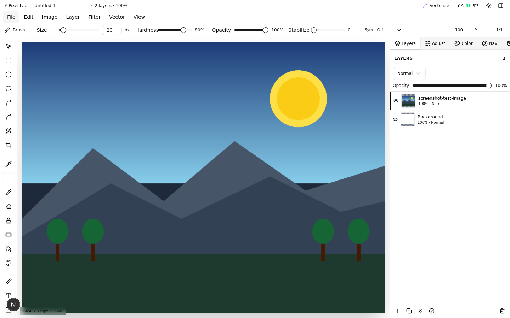
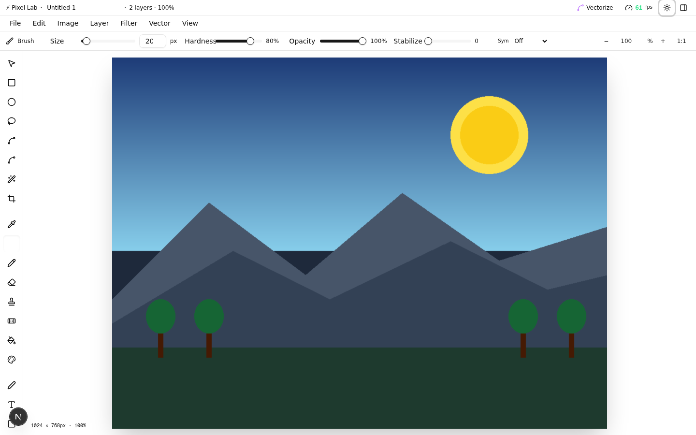
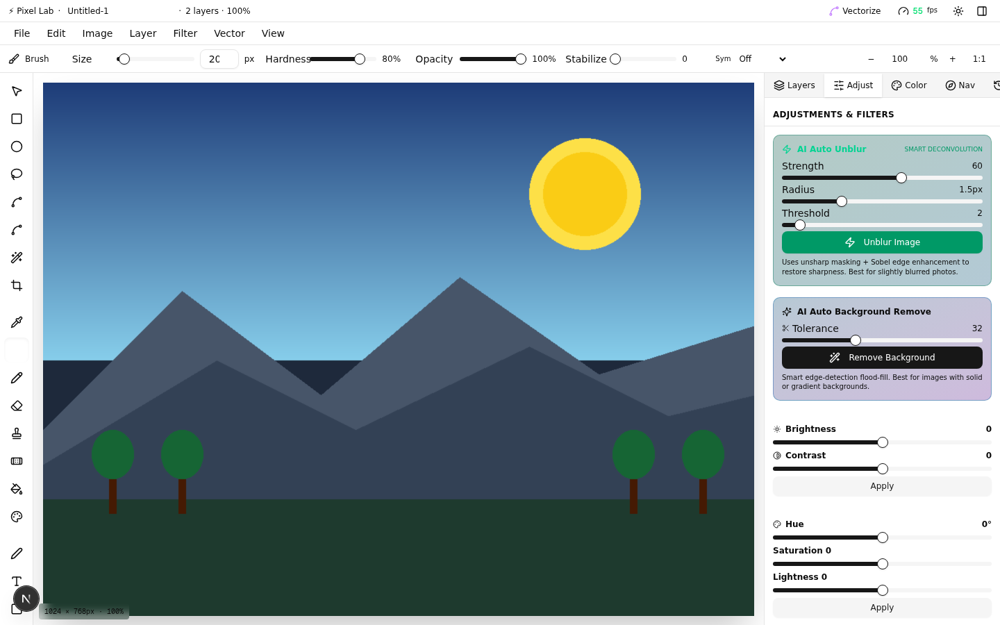
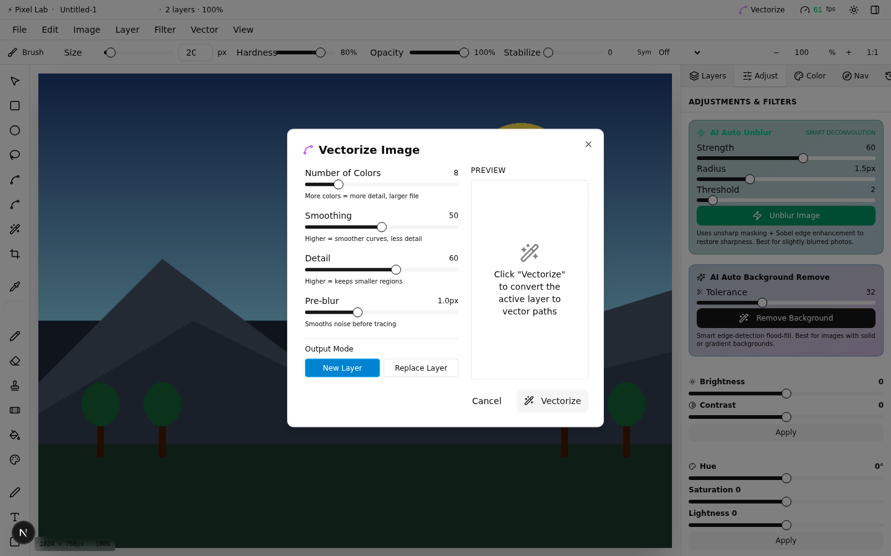
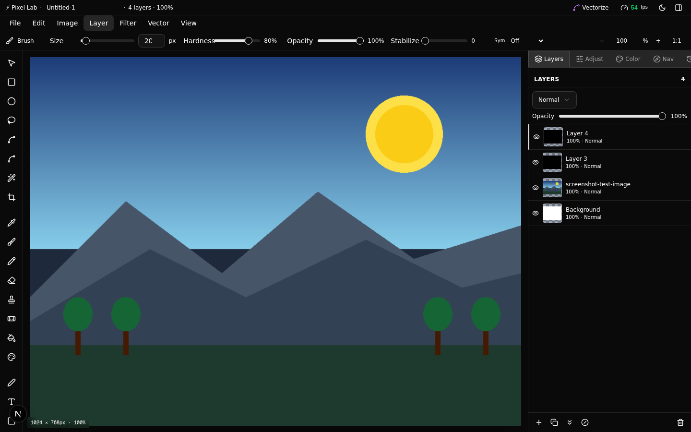
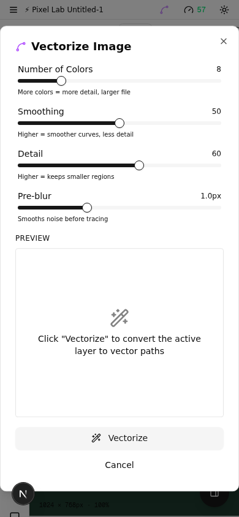

<div align="center">

# ⚡ Pixel Lab


**A professional, web-based image editor. 100% client-side — no cloud dependency.**

40 tools · Layers & masks · Lightroom-style develop · Vectorization · LUT color grading · Content-aware fill · **Luna AI assistant powered by Gemini** · Fully responsive

[](LICENSE)
[](https://nextjs.org/)
[](https://www.typescriptlang.org/)
[](https://tailwindcss.com/)
[](https://bun.sh/)

[🚀 Live Demo](https://pixel-lab-jade.vercel.app/) · [📖 Documentation](#documentation) · [🏗 Architecture](ARCHITECTURE.md) · [🤝 Contributing](CONTRIBUTING.md) · [🔒 Security](SECURITY_NOTES.md)

</div>

---

## Table of Contents

- [Overview](#overview)
- [Features](#features)
  - [🎨 Tools (40 tools across 6 categories)](#-tools-40-tools-across-6-categories)
  - [🖼️ Layers & Non-Destructive Editing](#️-layers--non-destructive-editing)
  - [📷 Lightroom-Style Develop Panel](#-lightroom-style-develop-panel)
  - [🎭 Drawing Aids](#-drawing-aids)
  - [📊 Pro Color Tools](#-pro-color-tools)
  - [🎬 Filters (25+)](#-filters-25)
  - [🔄 Vectorization](#-vectorization)
  - [🤖 Luna — AI Editing Assistant (Gemini-powered)](#-ai-editing-agent-gemini-powered)
  - [📐 Precision & Layout](#-precision--layout)
  - [🎭 Layer Effects](#-layer-effects)
  - [💾 Import & Export](#-import--export)
  - [📱 Responsive & Themeable](#-responsive--themeable)
  - [🎓 Learning](#-learning)
  - [⚡ Performance Optimized](#-performance-optimized)
- [Screenshots](#screenshots)
- [Getting Started](#getting-started)
  - [Prerequisites](#prerequisites)
  - [Installation](#installation)
  - [Build for Production](#build-for-production)
- [Usage](#usage)
  - [Keyboard Shortcuts](#keyboard-shortcuts)
  - [Quick Start Guide](#quick-start-guide)
  - [Pro Tips](#pro-tips)
  - [Luna](#luna-ai-editing-assistant)
- [Tech Stack](#tech-stack)
- [Project Structure](#project-structure)
- [Documentation](#documentation)
- [Roadmap](#roadmap)
- [Contributing](#contributing)
- [License](#license)
- [Acknowledgments](#acknowledgments)

---

## Overview

Pixel Lab is a browser-based image editor built with Next.js 16, TypeScript, and the HTML5 Canvas API. The entire editing pipeline runs in the browser — there is no server-side image processing. It features 40 tools, layers with non-destructive masks, a Lightroom-style develop panel, raster-to-SVG vectorization, LUT color grading, content-aware fill, and a **Gemini-powered Luna** that translates natural-language prompts into real editor operations.

The app is designed around five core principles:

1. **Client-side only** — All processing happens in the browser. No server roundtrips for editing operations. (The only external API call is the user's own Gemini key, sent directly to Google by Luna — never to a backend of ours.)
2. **Canvas-based** — Each layer is an offscreen `<canvas>` element. The visible canvas is a composite of all layers.
3. **Non-destructive** — Layer masks, history snapshots, and adjustment layers preserve original data.
4. **Performance-first** — LUTs, scanline algorithms, and throttling keep operations fast.
5. **Responsive** — Mobile and desktop share the same codebase with adaptive UI.
6. **Luna safety** — Every Luna tool call mutates a cloned offscreen workspace, never the live canvas. The undo stack is touched only on explicit Accept.

---

## Features

### 🎨 Tools (40 tools across 6 categories)

**Selection**
- Move, Rectangular/Elliptical Marquee, Lasso (freehand/polygonal/magnetic), Magic Wand, Crop

**Painting**
- Brush (soft/hard), Pencil, **Blob Brush** (fills that merge), **Calligraphy Brush** (angle-aware), **Scatter Brush** (random shapes), Eraser, Clone Stamp, Healing Brush, **Smooth Tool**, Paint Bucket, Gradient

**Pen & Vector**
- Pen Tool (Bezier curves), **Curvature Pen** (auto-smooth), Text

**Shapes**
- Rectangle, Ellipse, Line, **Star** (adjustable points + inner radius), **Polygon** (3-12 sides), **Arrow** (adjustable head), **Heart**, **Speech Bubble**, **Spiral** (adjustable turns)

**Liquify**
- Push, Pucker, Bloat, Twirl

**View**
- Hand (pan), Zoom

### 🖼️ Layers & Non-Destructive Editing
- Unlimited layers with drag-to-reorder
- **Layer Masks** (non-destructive) — Add, Toggle, Remove, Invert
- **Adjustment Layers** — Non-destructive filter layers with re-editable settings
- 16 blend modes (Normal, Multiply, Screen, Overlay, etc.)
- Per-layer opacity, visibility, lock
- Merge Down, Merge Visible, Flatten Image
- **Align Layers** — Align Left/Center/Right, Top/Middle/Bottom
- Duplicate, rename, delete
- **Copy/Paste** between layers (Ctrl+C / Ctrl+V)

### 📷 Lightroom-Style Develop Panel
A full photo development panel with 5 sections:
- **Light**: Exposure, Contrast, Highlights, Shadows, Whites, Blacks, Clarity, Dehaze, Texture
- **Color**: Vibrance (selective saturation), Saturation
- **Effects**: Film Grain (amount + size), Lens Vignette (amount, midpoint, roundness, feather)
- **Detail**: Sharpening (amount, radius, detail), Luminance Noise Reduction, Color Noise Reduction
- **Split Toning**: Highlight hue/saturation, Shadow hue/saturation, Balance

### 🎭 Drawing Aids
- **Symmetry Mode** — None, Horizontal, Vertical, Quad, Mandala (2-12 segments)
- **Brush Stabilizer** — Weighted moving average for smoother strokes
- **Brush Presets** — 8 defaults + save your own (persists in localStorage)
- **Eyedropper** — Sample colors from canvas
- **Color Picker** — SV picker, hue slider, hex/RGB inputs, swatches

### 📊 Pro Color Tools
- **Curves** — S-curve with adjustable mid-point
- **Levels** — Black/White/Gamma adjustment
- **Channel Mixer** — Mix R/G/B channels
- **HDR Toning** — Local contrast enhancement (CLAHE-lite)
- **LUT Color Grading** — Import and apply .cube LUT files with intensity control
- Brightness/Contrast, Hue/Saturation, Color Temperature

### 🎬 Filters (25+)
- **Blur**: Gaussian Blur, Fast Blur
- **Sharpen**: Unsharp Mask, Auto Unblur (deconvolution)
- **Denoise**: Median filter
- **Artistic**: Vignette, Add Noise (grain), Sepia, Grayscale, Invert, Threshold, Posterize, Pixelate
- **Edge**: Edge Detect (Sobel), Emboss
- **Texture**: Seamless Pattern Maker, Offset (Wrap)
- **Smart**: Auto Background Remove (edge flood-fill), Auto Unblur, Content-Aware Fill

### 🔄 Vectorization
- Convert raster images to SVG paths
- Median cut color quantization (2-32 colors)
- Moore neighborhood boundary tracing
- Ramer-Douglas-Peucker path simplification
- Quadratic Bezier curve smoothing
- Live preview with adjustable settings
- Export as `.svg` or apply as new layer

### 🤖 Luna — AI Editing Assistant (Gemini-powered)

A Copilot-Chat-style panel that translates natural-language prompts into real editor operations, with a before/after preview you accept or reject. **Luna self-reviews its own work with a vision model before showing it to you**, and **learns your taste** from your accept/reject decisions.

<div align="center">

| | |
|---|---|
| **21 agent tools** | Filters, develop adjustments, selection, drawing, text, bucket fill, canvas snapshot, recipe CRUD |
| **Tool-calling loop** | Against Google's Gemini API (`gemini-flash-lite-latest` / `flash` / `pro`) |
| **🆕 Vision self-evaluation** | After tool calls, a vision model reviews BEFORE/AFTER images and scores the edit 1–10. Scores below 7 trigger an automatic retry with feedback (up to 2 retries). You see fewer garbage results. |
| **🆕 Preference memory** | Every Accept/Reject is recorded to `localStorage` and summarized into the system prompt on subsequent runs — Luna adapts to what you like (e.g. "user tends to reject over-brightened skies"). |
| **Offscreen preview** | Every edit runs on a cloned canvas — live canvas & undo stack never touched until Accept |
| **Accept / Reject** | Accept commits to history (Ctrl+Z undoes normally); Reject discards without touching history. Both feed the preference memory. |
| **Stop button** | Cancel an in-flight agent run at any time |
| **MAX_TOOL_CALLS = 8** | Hard stop — surfaces an error instead of looping silently |
| **API key security** | Key lives only in browser JS memory (never persisted); calls go directly to Google, never to our backend |

</div>

**Tool set:**

| Tool | What it does |
|---|---|
| `applyFilter` | Gaussian blur, sharpen, sepia, grayscale, invert, posterize, pixelate, edge detect, emboss, add noise, vignette |
| `adjustDevelop` | Lightroom-style: exposure, contrast, highlights, shadows, whites, blacks, clarity, dehaze, texture, vibrance, saturation, grain, vignette, sharpening, luminanceNR, colorNR, split toning |
| `selectRegionByPoint` | Magic Wand flood-fill at a normalized (x, y) point |
| `selectRegionByBox` | Rectangular marquee in normalized 0-1 coords |
| `invertSelection`, `deselectAll` | Selection management |
| `contentAwareFill` | Fill selection with surrounding pixels (inpainting) |
| `autoBackgroundRemove` | Edge flood-fill background removal |
| `addAdjustmentLayer` | Brightness/contrast, vibrance, exposure, hue/saturation |
| `drawShape` | Ellipse/circle, rectangle, line, star, polygon, arrow, heart |
| `drawBrushStroke` | Freehand brush stroke through a list of points |
| `addText` | Render text with font, size, color, alignment |
| `fillBucket` | Paint-bucket flood-fill (any CSS color) |
| `undo` | (No-op in preview — Reject is the real undo) |
| `getCanvasSnapshot` | Returns current workspace composite as base64 JPEG + metadata (docWidth, docHeight, zoom, activeLayerId, layerCount) |
| `saveRecipe` | Persist an automation recipe (name + step array) to the automations store |
| `listRecipes` | List all saved recipes with step count and timestamps |
| `runRecipe` | Execute all steps of a named recipe sequentially |
| `deleteRecipe` | Remove a saved recipe by name |

**Try prompts like:** *"make it grayscale"*, *"brighten the sky and add a vignette"*, *"draw a red circle in the center"*, *"fill the background blue"*, *"write Hello World in green at the top-left"*, *"remove the person in the corner"*.

See [SECURITY_NOTES.md](SECURITY_NOTES.md) for honest disclosure of the API key handling, and [ARCHITECTURE.md → Luna](ARCHITECTURE.md#luna-ai-editing-assistant-gemini-powered) for the full architecture.

### 📐 Precision & Layout
- **Rulers & Guides** — Add/clear guides, snap toggle
- **Grid** — 50px grid overlay, Snap to Pixel Grid
- **Navigator Panel** — Live minimap with click-to-recenter
- **Transform** — Rotate 90/180/270, Flip H/V, Skew, Image Size resize
- **Align Layers** — 6 alignment options for multi-layer composition

### 🎭 Layer Effects
- Drop Shadow (color, offset, blur, opacity)
- Stroke (color, width)
- Outer Glow (color, size, opacity)

### 💾 Import & Export
- **Drag-and-drop** import — Drop any image file anywhere on the page
- **Recent Files** — Quick access to last 5 edited images
- **Batch Processing** — Process multiple files at once
- **Export formats**: PNG, JPEG, WebP, GIF, SVG
- **Export Presets** — Save format/quality/resize settings
- **Quick Export** button in title bar for one-click PNG
- **24 Document Templates**: Social media, Print, Digital, Mobile, Icons

### 📱 Responsive & Themeable
- **Mobile bottom toolbar** — 10 quick tools + expandable to 20+, color swatches
- **Canvas zoom controls** — Fit, 1:1, +, − buttons on canvas
- **Auto-fit zoom** — Re-fits on viewport resize/rotation
- **Auto light/dark mode** — Detects OS preference via `next-themes`
- **Manual theme toggle**: Light/Dark/System
- **Performance tiers**: Auto-detects Low/Medium/High and adjusts settings

### 🎓 Learning
- **Onboarding Tour** — 7-step interactive tour for new users
- **Interactive Tutorial** — 12-step guided photo editing walkthrough with auto-detection
- **Keyboard Shortcut Editor** — Customize shortcuts, persisted to localStorage

### ⚡ Performance Optimized
- **Scanline flood fill** — 10-100x faster Magic Wand, Bucket Fill, Auto BG Remove
- **LUT-based filters** — 3-5x faster Brightness/Contrast, Invert, Grayscale, etc.
- **Shadow-blur soft brush** — 8x fewer draw calls for soft brushes
- **JPEG history snapshots** — 5-10x memory reduction for opaque layers
- **Configurable history cap** — 15/30/60 states based on device tier
- **Throttled marching ants** — 15fps instead of 60fps
- **Pointer capture** — Smooth strokes even when pointer leaves canvas
- **Live FPS counter** with performance settings popover
- **100% client-side** — No cloud dependency, no server roundtrips

---

## Screenshots

### Dark Mode Editor


### Light Mode Editor


### Adjustments Panel


### Vectorize Dialog


### Layers Panel


### Mobile View


> 📸 **Luna screenshots**: Verification screenshots for the Luna (drawing tools, accept/reject, multi-step prompts, etc.) are in the development artifacts at `/home/z/my-project/download/agent-screenshots/` — not bundled with the repo to keep it lean.

---

## Getting Started

### Prerequisites

- **Node.js 18+** or **Bun** (recommended — faster installs & dev server)
- A modern browser with Canvas API support (Chrome, Firefox, Safari, Edge — latest 2 versions)

### Installation

```bash
# Clone the repository
git clone https://github.com/touhidsiddiqueeraj-bit/Pixel-Lab.git
cd Pixel-Lab

# Install dependencies (using bun recommended)
bun install
# or
npm install

# Start the development server
bun run dev
# or
npm run dev
```

Open [http://localhost:3000](http://localhost:3000) in your browser. The first compile takes ~5 seconds (Turbopack); subsequent hot-reloads are <200ms.

### Build for Production

```bash
bun run build
bun run start
```

The app is a standard Next.js application with `output: "standalone"` and can be deployed to Vercel, Netlify, or any Node.js host. All image processing is 100% client-side — no server-side processing required.

> **Note for self-hosting**: If you deploy behind a reverse proxy (e.g. Caddy, nginx), a sample `Caddyfile` is included in the repo.

---

## Usage

### Keyboard Shortcuts

| Shortcut | Action |
|----------|--------|
| `V` | Move tool |
| `M` | Rectangular Marquee |
| `L` | Lasso |
| `W` | Magic Wand |
| `C` | Crop |
| `I` | Eyedropper |
| `B` | Brush |
| `E` | Eraser |
| `S` | Clone Stamp |
| `J` | Healing Brush |
| `Y` | Smooth Tool |
| `P` | Pen Tool |
| `T` | Text |
| `U` | Rectangle Shape |
| `R` | Liquify Push |
| `H` | Hand (pan) |
| `Z` | Zoom |
| `X` | Swap foreground/background colors |
| `D` | Reset colors to black/white |
| `[` / `]` | Decrease/increase brush size |
| `Space` + drag | Pan canvas |
| `Ctrl+Z` | Undo |
| `Ctrl+Y` / `Ctrl+Shift+Z` | Redo |
| `Ctrl+A` | Select All |
| `Ctrl+D` | Deselect |
| `Ctrl+Shift+I` | Inverse Selection |
| `Ctrl+C` | Copy selection/layer |
| `Ctrl+V` | Paste as new layer |
| `Ctrl+S` | Quick Export PNG |
| `Ctrl+Shift+V` | Open Vectorize dialog |
| `Ctrl+Shift+U` | Auto Unblur (quick) |
| `Ctrl++` / `Ctrl+-` | Zoom in/out |
| `Ctrl+0` | Actual size (100%) |
| `Enter` (Pen tool) | Commit path |
| `Esc` (Pen tool) | Cancel path |
| `Alt+Click` (Clone/Heal) | Set source |

### Quick Start Guide

1. **Import an image**: Drag-and-drop a file onto the page, or File → Open
2. **Draw**: Select the Brush tool (`B`), pick a color, and draw on the canvas
3. **Add layers**: Layer → New Layer (`Ctrl+Shift+N`) to work non-destructively
4. **Develop photo**: Open the Develop tab for Lightroom-style adjustments
5. **Apply filters**: Adjust tab or Filter menu for effects
6. **Content-Aware Fill**: Select an area → Edit → Content-Aware Fill
7. **Color grade**: Filter → Apply LUT (.cube file) for cinematic looks
8. **Vectorize**: Vector → Vectorize Image (`Ctrl+Shift+V`) to convert to SVG
9. **Export**: Click the Export button in the title bar, or File → Export

### Pro Tips

- **Non-destructive workflow**: Use layer masks instead of erasing. Select area → Layer → Layer Mask → Add
- **Symmetry drawing**: Enable Mandala mode in OptionsBar for mesmerizing symmetric patterns
- **Healing brush**: Alt+Click on clean skin, then paint over blemishes for content-aware removal
- **Auto Unblur**: Filter → Auto Unblur to restore sharpness to slightly blurred photos
- **Auto Background Remove**: Develop tab → Remove Background for quick cutouts
- **Seamless patterns**: Filter → Make Seamless Pattern for tileable game textures
- **Performance**: Click the FPS counter in the title bar to adjust settings for your device
- **Drag & drop**: Just drop an image file anywhere on the page to open it

### Luna (AI Editing Assistant)

The **Agent** tab in the right panel lets you describe edits in plain English and have Google's Gemini translate them into real editor operations.

**Setup:**

1. Get a free Gemini API key from https://aistudio.google.com/apikey
2. Open the **Agent** tab (right panel, next to History)
3. Paste your key in the API key input (it stays in browser memory only — never persisted to localStorage)

**Try these prompts:**

| Prompt | What happens |
|---|---|
| `make it grayscale` | One tool call (`applyFilter(grayscale)`) + accept/reject preview |
| `brighten the sky and add a vignette` | Multi-step: `selectRegionByBox` → `adjustDevelop(exposure)` → `deselectAll` → `applyFilter(vignette)` |
| `draw a red circle in the center` | `drawShape(ellipse, 0.3, 0.3, 0.7, 0.7, #ff0000)` |
| `draw a yellow rectangle with a black outline` | `drawShape(rect, …, yellow, #000000, strokeWidth=5)` |
| `draw a green star in the middle` | `drawShape(star, 0.5, 0.5, …, #00ff00)` |
| `fill the background blue` | `fillBucket(0.5, 0.5, "blue")` — named colors work |
| `write Hello World in green at the top-left` | `addText("Hello World", 0.1, 0.1, #00ff00, fontSize=72)` |
| `remove the person in the corner` | `selectRegionByBox` → `contentAwareFill` |
| `boost the saturation slightly` | `adjustDevelop(color.saturation = 25)` |

**How it works:**

1. The agent snapshots your canvas into an **offscreen workspace** before running
2. Each tool call mutates the workspace, not the live canvas — you see progress chips in the chat thread
3. 🆕 When the tool calls finish, a **vision model reviews BEFORE vs AFTER** and scores the edit 1–10. If the score is below 7, the agent **retries with feedback** (up to 2 times) before showing you anything.
4. You get a **before/after preview** with the agent's self-score + reasoning displayed above the Accept/Reject buttons
5. **Accept** commits to the layer + pushes a history entry (Ctrl+Z undoes it normally)
6. **Reject** discards the preview without touching the undo stack
7. 🆕 Both Accept and Reject are **recorded to preference memory** (in `localStorage`). On your next request, Luna's system prompt includes a summary like "User tends to reject over-brightened skies" — so it adapts to your taste over time.
8. **Stop** cancels an in-flight run; **MAX_TOOL_CALLS = 8** prevents infinite loops

**The preference memory panel** (brain icon in the Luna header) shows your accept rate, accepted/rejected counts, self-eval agreement % (how often the agent's own score matched your decision), and recent examples. Use the "Clear memory" button to reset.

**Colors:** Any CSS color works — hex (`#ff0000`), named (`red`, `blue`, `yellow`), `rgb()`, or `hsl()`.

**Security:** Your API key is sent only to `generativelanguage.googleapis.com` — never to any backend of ours, never persisted to localStorage. Preference memory stores only edit descriptions + decisions (no images, no API keys). See [SECURITY_NOTES.md](SECURITY_NOTES.md) for the full honest disclosure.

---

## Tech Stack

| Layer | Technology |
|---|---|
| **Framework** | Next.js 16 with App Router + Turbopack |
| **Language** | TypeScript 5 |
| **Styling** | Tailwind CSS 4 with shadcn/ui primitives |
| **State Management** | Zustand 5 |
| **Theme** | next-themes (system / light / dark) |
| **Canvas** | HTML5 Canvas API with custom three-canvas rendering engine |
| **Luna** | Google Gemini API (`generateContent` with `functionDeclarations`) — called directly from the browser, no backend proxy |
| **Icons** | Lucide React |
| **Toasts** | Sonner |
| **Database** | Prisma (optional — for app-level features like recent files, not for image data) |
| **Package Manager** | Bun (recommended) or npm |

**No cloud dependency:** 100% client-side processing. The only external API call is the user's own Gemini key, sent directly to Google by Luna.

---

## Project Structure

```
pixel-lab/
├── src/
│   ├── app/                    # Next.js app router
│   │   ├── layout.tsx          # Root layout with ThemeProvider
│   │   ├── page.tsx            # Main page (renders PhotoEditor)
│   │   └── globals.css         # Global styles + theme variables
│   ├── lib/                    # Core libraries
│   │   ├── editor-types.ts     # TypeScript types (40 tool types, 16+ tool options)
│   │   ├── editor-store.ts     # Zustand store with all state and actions
│   │   ├── image-processing.ts # Filter algorithms, Lightroom adjustments, LUT, content-aware fill (~1950 lines)
│   │   ├── vectorize.ts        # Raster-to-SVG vectorization pipeline
│   │   ├── vector-shapes.ts    # Illustrator-style shape drawing (star, polygon, arrow, heart, etc.)
│   │   ├── perf.ts             # Performance utilities, device detection, RAF throttle
│   │   └── agent/              # Luna — AI assistant (Gemini-powered)
│   │       ├── agent-store.ts  # Zustand slice — in-memory API key, chat thread, pending preview, self-eval result, preference memory (localStorage-persisted)
│   │       ├── gemini-client.ts# Thin wrapper around Gemini generateContent with functionDeclarations + evaluateEditQuality (vision-based self-eval)
│   │       ├── tools.ts        # 21-tool schema + executor wrapping existing editor functions
│   │       └── agent-runner.ts # Orchestration loop — offscreen workspace, MAX_TOOL_CALLS, self-eval + retry, preference memory, commit/reject
│   │   └── figma/              # Figma API import
│   │       └── figma-import.ts # Figma file/frame API client (two endpoints, PAT auth)
│   └── components/
│       ├── ui/                 # shadcn/ui components
│       └── editor/             # Editor components
│           ├── PhotoEditor.tsx         # Main container (responsive layout)
│   ├── EditorCanvas.tsx        # Canvas & tool implementations (~2100 lines)
│           ├── Toolbar.tsx             # Left toolbar (desktop) / bottom toolbar (mobile)
│           ├── OptionsBar.tsx          # Context tool options
│           ├── MenuBar.tsx             # Top menu bar
│           ├── LayersPanel.tsx         # Layers management
│           ├── AdjustmentsPanel.tsx    # Filters & adjustments
│           ├── DevelopPanel.tsx        # Lightroom-style develop panel
│           ├── ColorPanel.tsx          # Color picker
│   ├── HistoryPanel.tsx        # Undo/redo history
│   ├── FigmaImportDialog.tsx   # Import frames from Figma (PAT auth, frame selector, progress)
│           ├── NavigatorPanel.tsx      # Minimap & brush presets
│           ├── AgentPanel.tsx          # Luna (Copilot-Chat-style UI + self-eval display + preference memory panel)
│           ├── VectorizeDialog.tsx     # Vectorization dialog
│           ├── NewDocumentDialog.tsx   # New document presets
│           ├── Onboarding.tsx          # 7-step onboarding tour
│           ├── TutorialPanel.tsx       # 12-step interactive tutorial
│           ├── ThemeToggle.tsx         # Light/dark toggle
│           ├── PerformanceControls.tsx # FPS & perf settings
│           └── tool-presets.tsx        # Tool metadata
├── public/
│   ├── pixel-lab-logo.svg      # Logo
│   └── screenshots/            # App screenshots
├── prisma/                     # Prisma schema (optional)
├── examples/                   # Example code (e.g. websocket server)
├── .github/                    # GitHub templates (issues, PR, code of conduct, dependabot)
├── ARCHITECTURE.md             # System architecture (deep dive)
├── EXTENSIONS.md               # How to create extensions, connect external AI agents via MCP
├── CONTRIBUTING.md             # Contribution guide
├── SECURITY_NOTES.md           # Honest disclosure of Luna API key handling
├── LICENSE                     # MIT License
└── README.md                   # This file
```

---

## Documentation

| Doc | What it covers |
|---|---|
| [**Architecture**](ARCHITECTURE.md) | System design, data flow diagrams, canvas rendering engine, Luna loop (incl. self-eval + preference memory), performance system, extension points |
| [**Extensions**](EXTENSIONS.md) | How to create automation recipes, connect external AI agents via MCP, add new tools, and extend Pixel Lab programmatically |
| [**Contributing**](CONTRIBUTING.md) | Dev setup, coding standards, how to add new tools / filters / agent tools, PR process, test scripts |
| [**Security Notes**](SECURITY_NOTES.md) | Honest disclosure of Luna API key handling + preference memory storage — what's safe, what isn't, what you can do |
| [**Changelog**](CHANGELOG.md) | Notable changes per release (latest: magnetic lasso fix, mobile redesign, Luna self-eval + preference memory) |
| [**Code of Conduct**](.github/CODE_OF_CONDUCT.md) | Contributor Covenant — our community standards |

---

## Roadmap

### Recently shipped ✅

- **🆕 Magnetic Lasso fixed** — proper BT.601 luminance + lowered Sobel threshold for reliable edge snapping; click-to-add manual anchors; double-click / Enter to close; pulsing start-anchor + snapped-point visual feedback; per-move `setSelection` allocation removed (no more UI freeze on large docs)
- **🆕 Mobile layout redesigned from scratch** — 2-row bottom toolbar (category strip + tool strip) with all 3 lasso variants as distinct buttons, sticky color swatches, integrated Panels + Luna buttons (no more floating overlap), 44px+ touch targets throughout
- **🆕 Luna vision self-evaluation** — after tool calls, a vision model reviews BEFORE/AFTER and scores the edit 1–10. Scores <7 trigger automatic retry with feedback (up to 2 retries). Bad edits are caught before you see them.
- **🆕 Luna preference memory** — Accept/Reject decisions are recorded to `localStorage` and summarized into the system prompt on subsequent runs. Luna adapts to your taste over time.
- **🆕 Lasso overlay** — marching-squares contour trace replaces bounding-box `strokeRect` for lasso, polygonal lasso, magnetic lasso, and magic wand selection paths
- **🆕 Move tool** — snapshots active layer on pointerdown, live offset redraw, commits with `pushHistory('Move')` on pointerup; selection bounds translate with content
- **🆕 Canvas Snapshot MCP tool** — `getCanvasSnapshot` returns base64 JPEG + metadata via MCP image content block
- **🆕 Recipe MCP tools** — `saveRecipe`, `listRecipes`, `runRecipe`, `deleteRecipe` for headless automation management
- **🆕 Figma import** — File → Import from Figma with PAT auth, frame selector with thumbnails, progress bar
- Luna with 21 tools (filters, develop, selection, drawing, text, bucket fill, canvas snapshot, recipe CRUD)
- Offscreen workspace preview with Accept/Reject
- 4 drawing tools (`drawShape`, `drawBrushStroke`, `addText`, `fillBucket`) accepting any CSS color

### Next up 🚧

- **Multi-frame Figma import** — currently imports one frame at a time; batch frame import to layers is a natural extension
- **Layer mapping on Figma import** — positional matching against existing layers could auto-place imported frames
- **Per-step accept/reject** — currently the agent produces a single combined preview per turn (with self-eval retries happening transparently); a future config option could allow per-step review
- **Persistent chat history** — chat is per-session only in v1 to avoid clutter; could be persisted to `localStorage` if desired
- **Segmentation model (SAM)** for tighter selection masks — the existing Magic Wand tolerance/flood-fill is used as a bridge; a future `selectRegionBySegmentation` tool could plug in
- **More Luna tools** — pen tool paths, gradient fills, layer effects, perspective transform
- **Tunable self-eval threshold** — currently fixed at 7/10; a setting could let advanced users make Luna stricter or more permissive
- **Per-tool preference breakdown** — the preference memory already tracks which tools correlate with accept/reject; surfacing this in the UI would help users understand their own patterns

### Longer-term 🔭

- **Server-side proxy** for the Gemini API key (would remove client-side exposure entirely — out of scope per current "no cloud dependency" design, but worth considering for enterprise deployments)
- **Multi-image batch agent runs** — single active document only for v1
- **Voice input** for prompts

See the [open issues](https://github.com/touhidsiddiqueeraj-bit/Pixel-Lab/issues) for the full list and to propose your own.

---

## Contributing

Contributions are welcome! Please read [CONTRIBUTING.md](CONTRIBUTING.md) for details on:

- Development setup & coding standards
- How to add a new tool, filter, or Luna tool
- The PR process and review criteria
- Test scripts for Luna
- Security considerations for agent changes

Quick start:

```bash
# Fork & clone the repo, then:
bun install
bun run dev

# Make your changes, then verify:
bun run lint
```

Please follow the [Code of Conduct](.github/CODE_OF_CONDUCT.md) in all interactions.

---

## License

This project is licensed under the **MIT License** — see the [LICENSE](LICENSE) file for details. Feel free to use it for learning, personal, or commercial purposes.

---

## Acknowledgments

- Built with [Next.js](https://nextjs.org/), [Tailwind CSS](https://tailwindcss.com/), and [shadcn/ui](https://ui.shadcn.com/)
- Icons by [Lucide](https://lucide.dev/)
- Luna powered by [Google Gemini](https://ai.google.dev/)
- Inspired by Adobe Photoshop and Lightroom workflows
- Thanks to all the [contributors](https://github.com/touhidsiddiqueeraj-bit/Pixel-Lab/graphs/contributors) who make this project better

---

<div align="center">

**[⬆ Back to top](#table-of-contents)**

Made with care for the open-source community.

</div>
